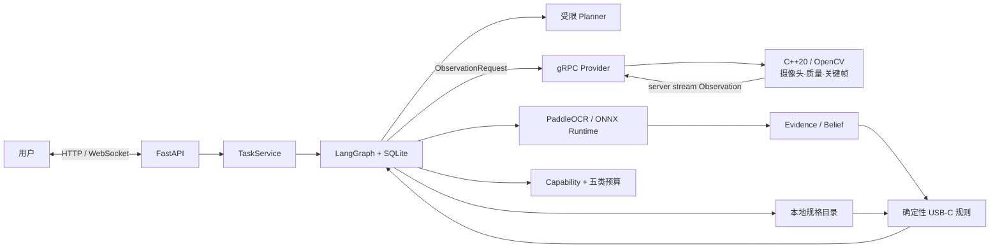

# RealSight

RealSight 是一个“复现并扩展”的证据驱动主动视觉项目：C++20/OpenCV 从连续视频中
筛选关键帧，Python Agent 把 OCR、用户输入和本地规格统一为可追溯 Evidence，最后由
确定性规则给出 USB-C 充电条件结论。信息不足或冲突时，系统请求补充证据，不猜答案。

> 当前定位：可运行、可测试的教学/作品集 Alpha，不是生产系统，也不代表真实 USB PD
> 协商已经成功。真实设备指标必须由仓库内的 JSONL 原始记录复算，不能填写估计值。

## 架构



最关键的边界：

- C++ 处理高频帧、背压、停止和质量筛选；Python 不接收逐帧视频。
- `Observation` 是一次合格观察，`Evidence` 是带来源、置信度和状态的业务事实。
- 模型只能从受限 `Action` 中选择下一步，不能直接生成兼容 verdict。
- `conditions_met` 只表示现有静态证据满足简化规则，不表示设备已实际充电成功。

## 已实现

- C++20 `jthread`/`stop_token`、有界队列、两种背压策略和 OpenCV 视频/摄像头源。
- 清晰度、曝光、抗反光、ROI 质量信号和只保留更优候选的关键帧选择。
- Protobuf/gRPC server streaming、deadline、Cancel RPC 和结构化失败。
- Pydantic 严格契约、LangGraph interrupt/resume、SQLite checkpoint。
- FastAPI 任务 API、WebSocket `after_sequence` 事件重放。
- 可选 `PaddleOcrTextRecognizer`：模型单例初始化、0～1 坐标、失败归一化、版本/耗时元数据。
- 正式启动入口按配置注入 C++ gRPC 与 PaddleOCR；默认配置仍诚实地声明不可用。
- capability、迭代、命令、观察、外部尝试和模型成本预算进入正式主循环。
- 可复算的真实设备 JSONL 数据格式和 p50/p95/错误正结论评测脚本。

## 5 分钟离线回放

前置：Python 3.12、[uv](https://docs.astral.sh/uv/)。离线回放不会下载 OCR 模型，也
不需要 API Key。

```powershell
uv sync --locked --all-groups
uv run --locked realsight-doctor
uv run --locked python examples/ch13_main_agent_loop.py
uv run --locked python examples/ch14_api_replay.py
uv run --locked pytest -m "not integration"
```

第 13 章会分别在标签观察和笔记本型号处暂停/恢复；第 14 章验证 HTTP、WebSocket 和
规则终态。教学替身 `ScriptedLabelRecognizer` 不是 OCR 成绩。

## C++ 与跨语言联调

C++ 需要 OpenCV、Protobuf 与 gRPC 开发包。配置和构建：

```powershell
uv run --locked cmake --preset windows-gcc-debug
uv run --locked cmake --build --preset windows-gcc-debug
uv run --locked ctest --preset windows-gcc-debug
uv run --locked python scripts/run_ch10_demo.py
uv run --locked python scripts/run_ch10_demo.py --verify-cancel
```

成功标志分别是 `CH10_DEMO_OK` 与 `CH10_CANCEL_OK`。关键帧工件写入
`runtime-data/ch10-artifacts/`，不会提交到 Git。

## 真实摄像头 + OCR + API

1. 安装可选 OCR 依赖：

```powershell
uv sync --locked --all-groups --extra ocr
```

2. 复制 `config/realsight.example.toml` 为本地配置，将
`perception.provider` 改为 `grpc`，`vision.provider` 改为 `paddleocr`。不要提交本地
路径、模型缓存或密钥。

3. 独立启动 C++ 摄像头服务：

```powershell
build\windows-gcc-debug\cpp\realsight-perception-grpc.exe `
  --camera 0 --listen 127.0.0.1:50051 `
  --artifacts runtime-data\camera-artifacts --max-frames 180
```

4. 在另一个终端启动正式 API：

```powershell
uv run --locked --extra ocr realsight-api --config config/realsight.local.toml
```

API 默认仅绑定 `127.0.0.1:8000`，OpenAPI 页面是
`http://127.0.0.1:8000/docs`。C++ 服务由独立进程拥有摄像头；FastAPI 不隐式启动或
重启硬件进程。

PaddleOCR 第一次运行可能需要准备本地模型。真实集成测试使用 `integration` marker，
普通 CI 使用注入式 fake pipeline，不下载模型。

```powershell
$env:REALSIGHT_OCR_TEST_IMAGE = "C:\path\to\charger-label.jpg"
uv run --locked --extra ocr pytest -m integration python/tests/test_ocr_integration.py
```

## 真实指标

先按 [真实设备评测手册](docs/REAL-DEVICE-VALIDATION.md) 采集至少 30 个样本，再运行：

```powershell
uv run --locked python scripts/evaluate_device_dataset.py `
  test-data/device-evaluation/manifest.jsonl `
  --json-output runtime-data/device-report.json `
  --markdown-output runtime-data/device-report.md
```

未完成采集前，本 README 不展示准确率或延迟占位值。安全准入底线是：缺失或冲突证据
样本的错误 `conditions_met` 数量为 0。

## 质量门禁

```powershell
uv run --locked pytest -m "not integration"
uv run --locked ruff format --check python/src python/tests scripts
uv run --locked ruff check python/src/realsight python/tests scripts
uv run --locked mypy python/src/realsight python/tests
uv run --locked cmake --build --preset windows-gcc-debug
uv run --locked ctest --preset windows-gcc-debug
```

GitHub Actions 在 Windows 验证 Python/契约生成，在 Linux 构建 C++ 并运行 C++→Python
gRPC 联调；普通 CI 不安装 OCR extra。

## 学习与作品集

- [项目总览](docs/PROJECT-OVERVIEW.md)：从问题、数据流到 14 章知识地图。
- [四周学习与答辩路线](docs/PORTFOLIO-ROADMAP.md)：每天的输入、动作、产物和验收。
- [模块地图](docs/MODULE-MAP.md)：每个文件的输入、输出和责任边界。
- [真实设备评测手册](docs/REAL-DEVICE-VALIDATION.md)：30 样本矩阵和数据格式。
- [项目审计](docs/FINAL-PROJECT-AUDIT.md)：已验证能力、风险和生产化缺口。

## 明确限制

- OCR 是应用集成，不是自训练模型；真实准确率尚需本地数据集证明。
- 本地规格目录是教学夹具，不是实时厂商知识库。
- API 没有认证、TLS、共享消息总线或多实例调度，只适合本机。
- 不验证线缆 e-marker、端口角色、PD 动态协商、多口功率分配和温升。
- 当前是单摄像头、单目标关键帧，不含检测、稳定 track ID、VIO 或 SLAM。

公开简历应使用“复现并扩展”，并只填写由实际设备报告生成的数字。
