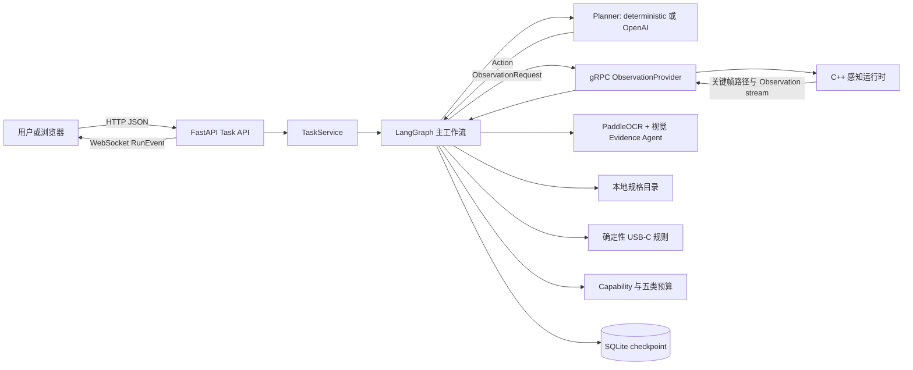

# RealSight 项目总览

## 项目要解决什么

RealSight 是一个一个月内可完成的工程型学习 MVP：让 C++ 连续接触现实世界的摄像头或
视频回放，让 Python 以证据驱动的工作流决定下一步，并在一个有限场景中给出可复核的
USB-C 充电条件判断。它不是通用商品识别、真伪鉴定平台，也不是一个让大模型自由聊天
的多 Agent 展示。

本项目的受控场景是：单摄像头、单个 USB-C 充电器、预录视频或实时摄像头、用户手动
提供笔记本型号、使用经过人工核验的本地规格目录。输出只能说明已知协议和功率条件，
不会声称已经在真实设备上充电成功。

## 总体架构



关键数据流不是“视频直接进入模型”，而是：

```text
连续视频帧
  -> C++ 质量分数和关键帧
  -> Observation(image_path, quality, timestamp)
  -> OCR/VLM 候选文本
  -> Evidence(source, confidence, status)
  -> BeliefState + 双目标上下文
  -> 资料 Evidence + USB-C 规则结果
  -> 带证据 ID 与未知边界的回答
```

## 14 章知识地图

| 章节 | 主要问题 | 可运行产物 |
|---|---|---|
| 1 | 为什么单图问答不足，什么是主动感知 | Evidence 缺口 Demo |
| 2 | 最小 Agent 如何产生结构化事件 | CLI 事件流 |
| 3 | 异步、超时、服务和 Agent 如何分工 | 异步感知模拟 |
| 4 | 状态与跨语言契约如何固定 | Pydantic 与 Protobuf |
| 5 | 如何暂停、恢复而不丢任务 | LangGraph interrupt Demo |
| 6 | checkpoint、证据、artifact 如何分开存 | SQLite 存储 Demo |
| 7 | 如何限制权限、预算、重试和并发 | 治理中间件 Demo |
| 8 | 如何建立可安装、可测试的单仓 | uv/CMake/配置/doctor |
| 9 | C++ 如何做连续帧和线程队列 | 视频回放运行时 |
| 10 | 如何用 gRPC 传 Observation 而非视频 | C++/Python 流式 Demo |
| 11 | 如何把标签文字变成 Evidence | 视觉证据子 Agent |
| 12 | 如何检索资料并以规则判断 USB-C | 目录和规则 Demo |
| 13 | 如何规划、暂停、恢复完整证据循环 | 两次 interrupt 主循环 |
| 14 | 如何变成 API、事件流和可验收项目 | FastAPI/WebSocket Demo |

## 两种运行模式

| 模式 | 规划器 | 适合 | 不做什么 |
|---|---|---|---|
| `deterministic` | 固定、可审计的下一步选择 | 学习、CI、离线演示 | 不测试模型能力 |
| `openai` | OpenAI Responses API 函数工具调用 | 学习受限模型规划 | 不让模型决定硬件兼容性 |

两种模式共享 `Planner -> Action -> workflow` 接口。真实模型只选择允许工具，规则引擎
仍计算最终 verdict。没有 `OPENAI_API_KEY` 时，离线模式仍可跑通全部课程测试。

感知与视觉同样采用显式 provider：默认 `unavailable` 不伪造结果；真实设备模式将
`perception.provider=grpc`、`vision.provider=paddleocr`，由正式 `serve.py` 创建、注入
并在退出时关闭资源。PaddleOCR 属于可选依赖，普通 CI 使用 fake pipeline，不下载模型。

## 快速验收

```powershell
uv sync --locked --all-groups
uv run --locked python examples/ch13_main_agent_loop.py
uv run --locked python examples/ch14_api_replay.py
uv run --locked pytest
uv run --locked ruff check python/src/realsight python/tests
uv run --locked mypy python/src/realsight python/tests
```

完整模块职责见 [MODULE-MAP.md](MODULE-MAP.md)，学习顺序见
[PORTFOLIO-ROADMAP.md](PORTFOLIO-ROADMAP.md)，真实设备评测见
[REAL-DEVICE-VALIDATION.md](REAL-DEVICE-VALIDATION.md)，风险与未完成项见
[FINAL-PROJECT-AUDIT.md](FINAL-PROJECT-AUDIT.md)。
