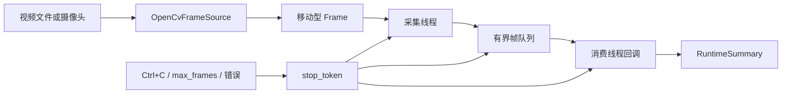

# 第 9 章 C++ 实时感知运行时：让连续现实变成可控的帧流

> 本章关键词：C++20、OpenCV 5、`cv::Mat`、`Frame`、单调时钟、移动语义、RAII、
> `FrameSource`、`cv::VideoCapture`、生产者/消费者、有界队列、背压、保留最新帧、
> `std::jthread`、`std::stop_token`、视频回放、摄像头、CTest、可观测统计

第 8 章把七组教学代码整理成了可构建的 C++/Python 单仓工程，但当时的 C++ 程序只会
输出一份能力说明。它没有读取视频，没有接触摄像头，也没有回答连续数据最困难的几个
问题：帧来得比处理快怎么办？停止时谁唤醒正在等待的线程？视频读完和摄像头断开为何
不能都叫“读取失败”？一张图片在两个线程之间由谁释放？

第 9 章开始让 RealSight 真正接触连续现实。本章不会接入 Agent，也不会把原始视频逐帧
发给 Python。目标更基础，也更重要：

> 建立一个可持续采集、可限制内存、可观察丢帧、可协作停止、可用预录视频重复测试的
> C++ 帧运行时。

---

## 1. 交付前质量鉴定摘要

本章正文是在代码、测试和 Demo 完成后定稿的。独立报告位于
`docs/reviews/09-quality-audit.md`，四项门禁结论如下：

| 鉴定项 | 结论 | 主要证据 |
|---|---|---|
| 逻辑闭环 | 通过，有明确能力边界 | 视频/摄像头统一为源，生产、排队、消费、停止和统计形成闭环 |
| 技术栈说明 | 通过 | 每项说明“是什么、为什么用、负责什么、不负责什么” |
| 小 Demo | 通过 | 生成 24 帧 AVI；无丢帧与慢消费者两种回放均实机验证 |
| 前后桥接 | 通过 | 继承第 8 章 target/doctor/CI，为第 10 章质量评分与 Observation 留出消费端口 |

鉴定没有把“物理摄像头已在所有电脑验证”写成通过。本机自动验收使用真实 AVI 编解码，
但没有占用用户摄像头；摄像头驱动、权限和设备索引仍需在具体机器上执行手工验收。

---

## 2. 本章目标、前提与产物

### 2.1 学习目标

完成本章后，你应该能够解释并亲手修改以下内容：

1. 原始 `Frame` 与领域 `Observation` 为什么不是同一层对象。
2. 为什么采集时间使用 `steady_clock`，而不是把系统日期当持续时间基准。
3. `cv::Mat` 的引用计数、移动语义和 `Frame` 禁止复制分别解决什么问题。
4. 摄像头与视频文件怎样通过 `FrameSource` 对上层隐藏差异。
5. 有界队列为什么是实时系统的必要条件。
6. `drop_oldest` 与 `block_producer` 各自牺牲什么、保护什么。
7. `jthread`、`stop_source`、`stop_token` 和条件变量怎样协作退出。
8. 正常 EOF、外部停止、消费方停止、源错误和消费方错误怎样被区分。
9. 如何用 CMake target、CTest 和生成的视频夹具验证 C++ 运行时。

### 2.2 学习前提

你不需要熟练掌握模板元编程或操作系统内核，但应当已经完成第 8 章，并知道：

- CMake 的 target 不等于源文件目录。
- `RealSight::runtime` 是可复用库，`realsight-perception` 是可执行入口。
- C++ 对象离开作用域时会调用析构函数。
- 线程并发意味着执行先后不能靠“看起来应该如此”来猜。

如果移动语义还不熟，可以先记住本章的工程规则：`Frame` 不能复制，只能把所有权从一个
位置交给下一个位置。后面的代码阅读会把原因讲清楚。

### 2.3 章节产物

本章新增或演进的正式产物包括：

- `Frame`：序号、采集时间、视频位置与像素。
- `FrameSource`：视频、摄像头和测试源的共同接口。
- `OpenCvFrameSource`：OpenCV `VideoCapture` 适配器。
- `BoundedFrameQueue`：有界并发队列与两种溢出策略。
- `PerceptionRuntime`：采集线程、消费循环、停止和统计。
- `realsight-perception`：可运行的视频/摄像头 CLI。
- `realsight-generate-video`：确定性 AVI 生成器。
- 四组 CTest：能力、队列、运行时、真实视频 I/O。
- Python 工程契约测试：注释、CMake 边界和 doctor 探测。

---

## 3. 为什么“循环 read”还不是实时运行时

最小 OpenCV 示例通常长这样：

```cpp
cv::VideoCapture capture(0);
cv::Mat frame;
while (capture.read(frame)) {
  process(frame);
}
```

它适合展示 API，却没有规定系统行为：

- `process` 需要 100ms，而摄像头每 33ms 来一帧时会发生什么？
- 视频文件会按原始帧率播放，还是以解码器最快速度冲完？
- 队列若无限增长，十分钟后内存会怎样？
- 用户取消时，等待中的线程如何醒来？
- `read` 返回 `false` 是视频正常结束，还是摄像头故障？
- 哪一帧被消费，哪一帧被丢弃，事后能否解释？

企业运行时的价值不在于多写一个循环，而在于把这些隐含选择变成显式契约。

本章的运行数据流是：



这里最重要的边界是：C++ 消费者仍在本进程内。第 10 章会把消费者替换成质量评分与关键帧
选择，再把低频 `Observation` 送往 Python，而不是把 `Frame` 直接送往 Agent。

---

## 4. 2026 技术栈定位

### 4.1 为什么继续使用 C++20

本章直接使用：

- `std::jthread`：析构时请求停止并等待线程结束。
- `std::stop_source` / `std::stop_token`：协作式取消。
- `std::stop_callback`：把外部取消转发给运行时内部停止源。
- `std::chrono`：用有单位的时间类型代替裸整数。
- `std::optional`：明确字段或帧“可能不存在”。
- 移动语义：传递高频图像而不复制整个像素缓冲区。

这些能力不会自动让程序线程安全，但它们让所有权和停止意图更容易被类型系统表达。

### 4.2 为什么使用 OpenCV 5

本机实际安装并验证的是 OpenCV 5.0.0。OpenCV 官方说明 5.x 与 4.x 都是稳定分支，
5.0 最低要求 C++17，并移除了旧 C API；RealSight 使用 C++20 和现代 C++ API，方向一致。
[OpenCV 5 官方说明](https://github.com/opencv/opencv/wiki/OpenCV-5)与
[4 到 5 迁移指南](https://github.com/opencv/opencv/wiki/OpenCV-4-to-5-migration)
都强调了这一变化。

本章只依赖 4.x/5.x 共通且成熟的模块：

| 模块 | 本章用途 | 本章不使用的能力 |
|---|---|---|
| `opencv_core` | `cv::Mat` 像素容器 | DNN、GPU 推理 |
| `opencv_videoio` | `VideoCapture`、`VideoWriter` | 网络流治理、硬件编码调优 |
| `opencv_imgproc` | 测试视频画矩形与文字 | 质量评分、OCR |

OpenCV 的 `VideoCapture` 可以打开摄像头、视频文件和图像序列，`read` 同时完成抓取与解码，
读取不到帧时返回 `false` 并产生空图像。这是适配器的底层事实，但“为什么没有帧”仍需由
我们结合源类型解释。[OpenCV VideoCapture 官方类参考](https://docs.opencv.org/4.13.0/d8/dfe/classcv_1_1VideoCapture.html)

### 4.3 CMake、CTest 与 doctor 各负责什么

| 工具 | 回答的问题 |
|---|---|
| CMake | OpenCV 头文件和库怎样进入正确 target？ |
| CTest | 编译后的 C++ 行为是否满足断言？ |
| `realsight-doctor` | 当前机器是否有 Python、编译器、CMake 和 C++ OpenCV 开发包？ |
| Python pytest | 源码是否保留教学注释和章节边界？ |

`opencv-python` 或 `cv2` wheel 只服务 Python 导入，不能给 C++ 编译器提供本章所需的
头文件、CMake package 和链接库。doctor 因此检查 `opencv5/opencv4` 的构建元数据，而
不是执行 `import cv2`。

---

## 5. Frame：一张图为什么还需要时间和身份

### 5.1 字段含义

本章 `Frame` 包含四项数据：

```cpp
struct Frame {
  std::uint64_t sequence;
  MonotonicClock::time_point captured_at;
  std::optional<std::chrono::milliseconds> source_position;
  cv::Mat pixels;
};
```

`sequence` 是源内递增序号。它帮助我们发现跳帧，也让 `last_consumed_sequence=23` 这种
统计可解释。

`captured_at` 是 C++ 进程观察到有效帧的单调时间。它用于排序、超时和延迟，不用于显示
“2026 年 8 月 14 日几点”。

`source_position` 是预录视频中的可选位置。摄像头没有固定媒体时间轴，所以该值通常为空；
视频 backend 也可能不给出可靠值，因此不能把它当成唯一身份。

`pixels` 是解码后的图像矩阵。本章通常是 BGR、8 位、三通道，但 `Frame` 本身没有把
颜色格式写死，第 10 章的评分器必须读取实际类型。

### 5.2 为什么不用 system_clock

系统时钟可能因为时间同步、用户修改或虚拟机调整而跳变。假设一帧记录 10:00:00.100，
下一帧系统时钟被校准成 09:59:59.900，用两个时间相减会得到负延迟。

`std::chrono::steady_clock` 的目标是持续向前，适合测量间隔。本章还防御极端情况下连续
两次读取到相同 tick：若新时间不大于上一帧，就增加一个最小时钟单位，从而保证源内
`captured_at` 严格递增。

注意：`steady_clock::time_point` 只在当前进程和当前启动周期内有意义。第 10 章若需要
跨进程传输，不能把它假装成 Unix 时间；应传相对运行起点的纳秒数或协议明确的时间字段。

### 5.3 Frame 为什么禁止复制

`cv::Mat` 本身是引用计数头部，复制 `cv::Mat` 通常是浅复制，多个对象共享像素缓冲区。
这很高效，但初学者容易在一个线程修改图像、另一个线程同时读取共享数据。

本章采取两层约束：

1. OpenCV 源每次读取到一个新的局部 `cv::Mat`，然后移动到 `Frame`。
2. `Frame` 删除复制构造和复制赋值，只保留移动。

这保证了 `Frame` 的逻辑所有权只有一份，并避免无意复制。它并不声称 `cv::Mat` 在所有
可能代码中绝对不会共享；未来若主动创建 ROI 或浅拷贝，仍需理解 OpenCV 引用计数。需要
真正隔离像素时应显式 `clone()`，但复制高清帧有成本，不能把它当成无脑保险。

### 5.4 RAII 如何释放帧

当最旧帧从队列弹出、消费回调结束或队列析构时，`Frame` 析构，内部 `cv::Mat` 的引用计数
下降；没有引用后像素内存被释放。代码不手写 `free`，这就是 RAII 在帧生命周期中的作用。

---

## 6. Frame 不等于 Observation

第 1 章已经区分了原始帧和有效观察，本章把这条边界落实为进程结构：

| 对象 | 频率 | 内容 | 生命周期 | 是否发往 Python |
|---|---:|---|---|---|
| `Frame` | 例如 20 到 60 次/秒 | 像素、序号、本地时间 | 短，可覆盖或丢弃 | 否 |
| `Observation` | 证据需要时才产生 | 质量、视角、裁剪图引用、元数据 | 可追踪 | 第 10 章开始可以 |
| `Evidence` | 更低频 | OCR/规格事实、来源、置信度 | 会话级持久化 | 是 |

如果一帧 1920×1080、BGR 三通道，未压缩像素约为：

```text
1920 × 1080 × 3 = 6,220,800 bytes ≈ 5.93 MiB
```

容量 4 的队列仅像素就约 23.7 MiB。若把每秒 30 帧都跨进程复制和 JSON/Base64 编码，
代价远高于传一条结构化观察。本章因此只把帧留在 C++。

---

## 7. FrameSource：用结果类型代替含糊的 bool

### 7.1 共同接口

```cpp
class FrameSource {
 public:
  virtual const SourceDescriptor& descriptor() const noexcept = 0;
  virtual SourceReadResult read(std::stop_token stop_token) = 0;
};
```

运行时只依赖 `FrameSource`，不依赖 `VideoCapture`。测试可以提供内存合成源，第 10 章也
可以增加录制源或设备 SDK 适配器，而不用改队列和运行时。

### 7.2 四种读取状态

`SourceReadStatus` 明确区分：

| 状态 | 含义 | 运行时行为 |
|---|---|---|
| `frame` | 有一帧有效数据 | 移动到队列 |
| `end_of_stream` | 有限视频正常读完 | 关闭队列，排空已有帧 |
| `stopped` | 收到协作式停止 | 关闭队列，结束运行 |
| `error` | 源故障 | 保存错误消息并结束 |

视频读完不是错误。如果把 EOF 当异常，自动回放测试会被错误标红；如果把摄像头断开当
EOF，在线服务又会伪装成正常完成。强类型状态让二者不能被一个 `false` 混淆。

### 7.3 防御第三方适配器抛异常

接口约定源用 `SourceReadResult::error` 返回故障，但未来第三方 SDK 适配器仍可能抛异常。
采集线程若让异常逃出线程函数，C++ 会调用 `std::terminate`。`PerceptionRuntime` 因此在
线程边界捕获标准异常和未知异常，把它们转成 `source_error`，测试也覆盖了这一分支。

---

## 8. OpenCvFrameSource：文件与摄像头的共同入口

### 8.1 打开视频文件

`open_video` 的步骤是：

1. 验证路径非空。
2. 优先用 `CAP_FFMPEG` 打开普通文件。
3. FFmpeg 不可用时回退 `CAP_ANY`。
4. 读取实际 backend、宽、高和 FPS。
5. 构造 `SourceDescriptor`。

优先 FFmpeg 不是说其他 backend 错误，而是减少 `CAP_ANY` 对普通文件尝试无关管线时的
噪声。最终选择仍通过 `getBackendName()` 输出，Demo 实测为 `FFMPEG`。

### 8.2 打开摄像头

摄像头使用设备索引，例如 `0`。宽、高和 FPS 设置只是请求：驱动可能拒绝、取最接近值，
甚至返回成功但采用另一配置。因此代码在设置后重新读取实际参数，`descriptor()` 不盲信
用户请求。

设备索引也不是稳定设备身份。拔插设备后 `0` 和 `1` 可能变化。一个月 MVP 接受单摄像头
索引；企业扩展应加入设备枚举、硬件标识、权限诊断和重连策略。

### 8.3 视频为什么需要回放节奏

对视频文件连续调用 `read`，OpenCV 通常会按解码速度读取，而不是自动等到原始显示时刻。
这对测试吞吐很有用，却不模拟实时输入。

本章有两种模式：

- 默认 `pace_as_recorded=true`：根据 `sequence / fps` 计算下一帧相对启动时间。
- `--no-realtime`：尽快解码，适合测试队列溢出和快速回归。

等待按最多约 5ms 的小段睡眠进行，以便检查停止令牌。实测 24 帧、20 FPS 的默认回放
耗时约 1204ms；不计编码首尾细节时，理论跨度接近 1.2 秒。

---

## 9. 有界队列：实时系统不能默认无限等待

### 9.1 无界队列的问题

若生产者每秒 30 帧，消费者每秒处理 10 帧，每秒积压 20 帧。按单帧 5.93 MiB 计算，
一分钟理论积压超过 7 GiB。系统不会因为用了队列就获得背压；无界队列只是把性能问题
推迟成内存问题和越来越旧的结果。

`BoundedFrameQueue` 构造时强制 `capacity > 0`，队列容量成为显式配置。

### 9.2 drop_oldest：保护新鲜度

队列满时先移除最旧帧，再放入新帧：

```text
满队列：[20, 21]
新帧：22
结果：[21, 22]
丢弃：20
```

这适合主动感知摄像头。Agent 说“请把充电器翻到背面”后，系统更关心用户现在展示的
画面，而不是两秒前的正面。

取消检查必须发生在丢帧前。本章审计曾发现：若先按溢出策略移除旧帧，再发现 stop token
已经取消，会在没有接收新帧的情况下破坏队列内容。修正后，预取消 push 会保留原帧，
并由确定性测试保护。

### 9.3 block_producer：保护完整性

队列满时，采集线程等待消费者释放位置。它适合：

- 确定性视频回放。
- 离线分析必须处理每一帧。
- 生成测试夹具后的完整性检查。

它不总适合摄像头。采集线程阻塞时，驱动或设备内部仍可能缓存帧，恢复后读到的数据已经
陈旧。所谓“没有在应用队列丢帧”不代表物理世界中的每帧都被保留。

### 9.4 两种策略如何选

| 问题 | `drop_oldest` | `block_producer` |
|---|---|---|
| 主要目标 | 新鲜度 | 完整性 |
| 队列满时 | 覆盖最旧帧 | 等待空位 |
| 是否记录丢帧 | 是 | 应为 0 |
| 摄像头实时判断 | 默认推荐 | 可能制造陈旧数据 |
| 离线回放/测试 | 可做压力测试 | 推荐确定性验证 |

默认策略是 `drop_oldest`，因为 RealSight 是主动感知运行时，不是视频归档系统。

---

## 10. 生产者与消费者怎样协作

### 10.1 为什么只有一个采集线程

本章限定单摄像头、单源。一个采集线程持续执行：

```text
source.read
-> produced_frames += 1
-> queue.push
-> dropped_frames += push_result.dropped_frames
```

调用 `run()` 的线程负责消费：

```text
queue.wait_pop
-> consumed_frames += 1
-> consumer(Frame&&)
-> 检查 max_frames / consumer stop / error
```

这种结构足以隔离设备读取与图像处理，也比一开始搭建线程池更适合教学。第 10 章质量评分
可以直接成为 consumer，不需要重写采集源。

### 10.2 为什么用 jthread

`std::thread` 要求程序员在每条控制路径显式 `join` 或 `detach`，漏掉会导致终止或资源
生命周期混乱。`std::jthread` 提供停止令牌并在析构时 join，但本章仍在返回摘要前显式
`request_stop()` 和 `join()`，让顺序可读：先发停止，再等待采集线程，最后读取终态。

### 10.3 condition_variable_any 与 stop_token

消费者等“队列非空”，阻塞生产者等“队列未满”。轮询会浪费 CPU，普通条件变量又需要
额外通知取消。本章使用支持 `stop_token` 的 `condition_variable_any::wait`：条件满足时
继续，停止请求到来时返回。

`close()` 同时通知两组等待者，并保持一个重要语义：关闭后拒绝新帧，但消费者仍可排空
已有帧。这样视频 EOF 到来时，队列最后几帧不会凭空消失。

---

## 11. 停止不是一个 bool

运行时可能因为以下原因结束：

| `RuntimeStopReason` | 示例 |
|---|---|
| `source_exhausted` | 视频正常读完 |
| `max_frames_reached` | Demo 要求最多消费 100 帧 |
| `consumer_requested` | 质量评分器认为已取得足够关键帧 |
| `external_stop` | Ctrl+C 或上层取消 |
| `source_error` | 摄像头断开、解码失败、适配器抛异常 |
| `consumer_error` | 后续图像处理回调异常 |

如果只返回 `success=false`，调用方无法判断是否重试、是否报警、是否正常结束。结构化停止
原因是第 10 章映射 gRPC 状态和第 13 章生成 `RunEvent` 的基础。

### 11.1 Ctrl+C 调用链

C 信号处理函数只设置 `sig_atomic_t` 标志，不在信号上下文里操作锁或复杂对象。一个轻量
`jthread` 每 10ms 检查该标志，再调用 `stop_source.request_stop()`。运行时通过
`stop_callback` 把外部 token 转发到内部停止源。

### 11.2 协作式取消的真实边界

`stop_token` 不是强制杀线程。它能取消：

- 队列的条件等待。
- 本章按小段执行的视频回放节奏等待。
- 每次读取之间的循环。

它不能保证打断已经进入摄像头驱动内部的阻塞 `VideoCapture::read`。若某个 backend 在
设备断开后永久不返回，本章只能等驱动调用返回。生产系统应进一步评估 backend 超时、
独立设备线程、SDK 取消 API 或进程级隔离。本章明确写出这个限制，不宣传“立即取消”。

---

## 12. RuntimeSummary：不用肉眼判断实时程序

每次运行输出：

```text
stop_reason
produced_frames
consumed_frames
dropped_frames
last_consumed_sequence
elapsed_ms
error_message
```

主要不变量是：

- 正常 `block_producer` 回放：`produced == consumed` 且 `dropped == 0`。
- 完整结束的 `drop_oldest` 回放：`produced == consumed + dropped`。
- 保留最新帧：结束后 `last_consumed_sequence` 应指向源最后一帧。
- 错误停止：`error_message` 非空且可行动。
- 消费到的 `captured_at` 严格递增。

不要只输出平均 FPS。两个程序都可能显示 30 FPS，一个处理当前帧，另一个处理五秒前的
积压帧，它们对主动感知完全不同。队列深度、丢帧和最后序号更接近业务真实状态。

---

## 13. CMake 怎样接入 OpenCV

核心声明是：

```cmake
find_package(OpenCV REQUIRED COMPONENTS core imgproc videoio)
```

`REQUIRED` 表示缺少开发包时在配置阶段失败，不把问题拖到链接。组件列表表达本章真正
需要的模块，避免“安装了整个包，所以任意模块都能随便用”的模糊依赖。

`realsight_runtime` 的公开头文件包含 `cv::Mat`，因此 OpenCV include 路径与链接库需要
沿 target 传播：

```cmake
target_include_directories(realsight_runtime PUBLIC ${OpenCV_INCLUDE_DIRS})
target_link_libraries(realsight_runtime PUBLIC ${OpenCV_LIBS})
```

本章实际配置输出：

```text
Found OpenCV: E:/msys64/ucrt64 (found version "5.0.0")
RealSight Chapter 9 uses OpenCV 5.0.0
```

CMake 文件顶部也按课程要求说明整体逻辑、技术栈、调用流程与边界。`find_package(gRPC)`
仍不存在，第 10 章才进入跨进程协议。

---

## 14. Windows 环境准备

本课程首要环境是 MSYS2 UCRT64 GCC。OpenCV 必须和编译器使用同一 ABI/前缀，不能把
MSVC 编译的预构建库随意链接给 MinGW GCC。

在正常且已同步的 UCRT64 环境中，包名是：

```text
mingw-w64-ucrt-x86_64-opencv
```

MSYS2 是滚动发行工具链。如果索引要求更新 GCC 运行库，却仍保留旧 GCC 主包，包管理器
会拒绝制造不一致组合。升级工具链是环境级操作，应在 MSYS2 UCRT64 终端中阅读事务列表，
按 MSYS2 的更新说明完成，而不是手工复制几个 DLL。

本机最终验证版本：

```text
GCC 16.2.0
OpenCV 5.0.0
CMake 4.4.2
```

运行 doctor：

```powershell
uv run --locked realsight-doctor --json
```

本章实测七项均为 `pass`，其中 `opencv-cxx` 为 `OpenCV 5.0.0 via pkg-config module
opencv5`。doctor 通过只代表开发包可解析，不代表摄像头权限和驱动已经验证。

---

## 15. Demo 一：生成确定性测试视频

先配置并构建：

```powershell
uv run --locked cmake --preset windows-gcc-debug
uv run --locked cmake --build --preset windows-gcc-debug
```

创建输出目录并生成 24 帧 AVI：

```powershell
New-Item -ItemType Directory -Force runtime-data
build\windows-gcc-debug\cpp\realsight-generate-video.exe `
  runtime-data\ch09-demo.avi 24
```

实测输出：

```json
{"event":"test_video_created","path":"runtime-data\\ch09-demo.avi","frames":24,"fps":20,"width":160,"height":90,"bytes":24566}
```

生成器使用 MJPG AVI，每帧有不同背景、移动矩形和序号。它不是生产功能，而是让测试输入
可重复。命令必须等生成器退出后再启动播放器；若并行执行，读取方可能在文件容器尚未
完成时打开它。本章实际审计就触发过该失败，OpenCV 正确拒绝了不完整视频。

---

## 16. Demo 二：完整、不丢帧回放

```powershell
build\windows-gcc-debug\cpp\realsight-perception.exe `
  --video runtime-data\ch09-demo.avi `
  --overflow block `
  --queue-capacity 4 `
  --no-realtime
```

关键实测输出：

```json
{"event":"source_opened","kind":"video_file","backend":"FFMPEG","width":160,"height":90,"fps":20}
{"event":"runtime_summary","runtime":{"stop_reason":"source_exhausted","produced_frames":24,"consumed_frames":24,"dropped_frames":0,"last_consumed_sequence":23,"elapsed_ms":4,"error_message":""},"timestamps_monotonic":true,"sampled_byte_sum":2377}
```

解释：

- 源正常读完，所以是 `source_exhausted`。
- 24 帧全部生产和消费。
- 阻塞策略没有丢帧。
- 序号从 0 开始，最后为 23。
- `--no-realtime` 让文件按解码速度运行，因此只需数毫秒。
- `sampled_byte_sum` 证明 consumer 确实访问了像素，不是只数空对象。

删除 `--no-realtime` 后，实测耗时约 1204ms，说明 20 FPS 节奏生效。

---

## 17. Demo 三：慢消费者与保留最新帧

```powershell
build\windows-gcc-debug\cpp\realsight-perception.exe `
  --video runtime-data\ch09-demo.avi `
  --overflow drop-oldest `
  --queue-capacity 2 `
  --consumer-delay-ms 20 `
  --no-realtime
```

实测摘要：

```json
{"stop_reason":"source_exhausted","produced_frames":24,"consumed_frames":3,"dropped_frames":21,"last_consumed_sequence":23,"elapsed_ms":94,"error_message":""}
```

`3 + 21 = 24`，每个生产帧都有去向；最后序号仍是 23，说明队列牺牲中间旧帧，保护了
最新画面。消费数量可能受调度略有变化，所以测试不把“必须正好消费 3 帧”写死，而验证
丢帧大于零、计数守恒和最后序号。不同复验中耗时约 94 到 105ms，也不作为固定断言。

---

## 18. Demo 四：物理摄像头手工验收

摄像头索引通常从 0 开始：

```powershell
build\windows-gcc-debug\cpp\realsight-perception.exe `
  --camera 0 `
  --max-frames 100 `
  --queue-capacity 4 `
  --overflow drop-oldest
```

本程序不弹预览窗口，100 帧后输出摘要。可用 Ctrl+C 提前停止。验收时检查：

1. `source_opened.kind` 是 `camera`。
2. backend、实际宽高和 FPS 有合理值。
3. `produced_frames` 与 `consumed_frames` 大于零。
4. `timestamps_monotonic=true`。
5. 停止原因与操作一致。

如果摄像头被会议软件占用、权限关闭或索引错误，启动会非零退出并打印可见错误。本章没有
在自动测试中打开用户摄像头，避免测试突然占用隐私设备。

---

## 19. 自动测试如何分层

### 19.1 CTest 四组行为测试

| 测试 | 证明什么 |
|---|---|
| `realsight-runtime-info` | 已实现能力与后续计划分开，Release 下检查不消失 |
| `realsight-frame-queue` | 容量、覆盖、阻塞取消、关闭排空、取消不误丢旧帧 |
| `realsight-perception-runtime` | 完整消费、慢消费丢帧、上限、外部停止、源/消费错误 |
| `realsight-opencv-source` | 真实 MJPG 写入/读取、8 帧序号、尺寸、严格时间、EOF |

执行：

```powershell
uv run --locked ctest --preset windows-gcc-debug
```

本章最终实测：

```text
4/4 tests passed
Total Test time (real) = 0.55 sec
```

第 8 章的 `assert` 测试已被显式 `TestContext` 替换。C 标准 `assert` 在定义 `NDEBUG`
的 Release 构建会消失，不能作为唯一行为门禁。当前轻量检查器不是通用测试框架；当项目
测试规模增加，可以引入 Catch2 或 GoogleTest，但本章不为四个小程序增加网络依赖。

### 19.2 Python 工程契约测试

`test_ch09_cpp_runtime_contract.py` 不假装执行 C++ 行为，它只检查容易遗忘的仓库约束：

- 每个 C++ 文件顶部有整体逻辑、技术栈和调用流程。
- CMake 文件有同样的学习说明。
- OpenCV 已接入，gRPC 尚未接入。
- C++ 测试不依赖运行时 `assert`。
- doctor 能识别 C++ OpenCV 开发包。

文本测试与行为测试各守不同边界，不能互相替代。

---

## 20. 代码阅读顺序

代码基础不强时，不建议从最长的 `perception_main.cpp` 开始。按以下顺序阅读：

1. `frame.hpp`：先理解一帧包含什么、为何不能复制。
2. `frame_source.hpp`：理解四种读取结果。
3. `frame_queue.hpp/.cpp`：画出队列满、关闭和取消三种状态。
4. `perception_runtime.hpp`：只看 options、summary 和 stop reason。
5. `perception_runtime.cpp`：分开阅读 producer lambda 与 consumer loop。
6. `opencv_frame_source.cpp`：看具体设备怎样实现抽象接口。
7. `perception_main.cpp`：最后把参数、信号、源和 runtime 串起来。
8. 测试：用测试反推每项契约的可观察结果。

每个新增 C++ 文件顶部都给出了同样四类信息：整体逻辑、技术栈、调用流程、重要边界。
注释集中解释“为什么”和线程/所有权关系，不逐行翻译语法。

---

## 21. 常见故障与诊断

### 21.1 CMake 找不到 OpenCV

症状：`Could NOT find OpenCV`。

检查顺序：

1. 安装的是 C++ 开发包，不是 Python wheel。
2. `g++` 与 OpenCV 是否都来自 UCRT64 前缀。
3. `realsight-doctor --json` 的 `opencv-cxx` 是否通过。
4. CMake 输出是否显示正确 OpenCV 版本和路径。

不要把另一个编译器 ABI 的 `.lib/.dll` 手工塞进链接命令。

### 21.2 能生成 AVI，但播放器打不开

首先确认生成器进程已经结束，文件大小不再变化。本章曾把生成器和播放器并行启动，读取方
在容器尾部尚未写完时失败，这不是队列错误。

其次看 `source_opened.backend`。不同系统可用 codec 不同，测试采用 MJPG 是为了提高桌面
环境兼容性，但 codec 支持最终仍由 OpenCV backend 提供。

### 21.3 丢帧很多

先判断目标：

- 若需要当前画面，丢旧帧可能是正确行为。
- 若离线分析必须完整，改用 `block`。
- 若容量调大后只是延迟增加，问题在消费者吞吐，不在容量。
- 记录 `produced/consumed/dropped/last_sequence`，不要只看 CPU。

### 21.4 Ctrl+C 不能立刻退出

若程序停在 OpenCV 驱动内部的阻塞读取，协作式 token 要等该调用返回。先尝试另一个
camera backend、检查设备状态；生产扩展再引入 backend 超时或进程隔离。不要用强杀线程
破坏 C++ 对象析构和设备释放。

### 21.5 Windows 出现 GLib/GIO 环境警告

本机 OpenCV 5 MSYS2 包即使实际 backend 为 FFmpeg，进程退出时仍可能由其可选组件输出
Windows 应用清单相关的 GLib/GIO 警告。实测 JSON 完整、退出码为 0、CTest 通过。它是
当前二进制依赖环境噪声，不应误判为帧读取失败；团队可在固定部署镜像中裁剪 backend 或
设置经过验证的 GLib 环境。不要在业务代码中吞掉所有 stderr，因为真正的解码错误也会
使用该通道。

---

## 22. 能力边界

本章已经完成：

- 单视频文件回放。
- 单摄像头打开和连续读取代码路径。
- 文件/摄像头统一接口。
- 严格单调的源内采集时间。
- 有界内存和两种溢出策略。
- 协作停止与结构化错误。
- 可审计运行统计。
- 真实编码/解码自动测试。

本章没有完成：

- 模糊、曝光、反光、目标占比评分。
- 关键帧筛选和裁剪图保存。
- gRPC、Protobuf 代码生成和 Python 通信。
- 摄像头自动重连、设备枚举和稳定硬件身份。
- 多摄像头同步。
- GPU/零拷贝采集。
- 音频采集。
- 生产级遥测后端。

这些不是“以后再说”的模糊清单，而是章节边界。尤其不要把 `camera_capture` 已实现解读成
“所有型号摄像头和驱动都已认证”。

---

## 23. 课后练习

### 练习一：手画所有权

画出一帧从 `cv::VideoCapture::read` 到 consumer 返回的所有权转移，并标出每次
`std::move`。回答：为什么 consumer 不能保存 `Frame&` 到回调结束之后？

### 练习二：计算容量

对 1280×720、1920×1080 两种 BGR 图像，分别计算容量 2、4、8 的理论像素内存。不计
容器头部。说明为什么容量不是越大越好。

### 练习三：比较策略

分别运行：

```text
--overflow block --consumer-delay-ms 20 --no-realtime
--overflow drop-oldest --consumer-delay-ms 20 --no-realtime
```

记录 produced、consumed、dropped、elapsed 和 last sequence，解释两种策略的差异。

### 练习四：增加消费者主动停止

修改 CLI consumer，让它在采样字节和超过某个阈值时返回 `ConsumerDecision::stop`。补测试
验证 stop reason 是 `consumer_requested`，而不是 `external_stop`。

### 练习五：摄像头参数不是承诺

为 CLI 增加请求宽高参数，打开摄像头后同时输出“requested”和“actual”。在你的设备上
观察驱动是否严格接受请求。

### 练习六：故障注入

阅读 `ThrowingFrameSource` 测试。再写一个源：先返回两帧，然后抛异常。说明队列里已产生
帧应当被排空还是立即丢弃，并把你的选择写成测试。

---

## 24. 本章设计产物

建议你把以下内容放入自己的学习笔记，而不是只保存编译结果：

1. 一张 `FrameSource -> Queue -> Consumer` 时序图。
2. 一张 `drop_oldest` 与 `block_producer` 决策表。
3. `Frame` 四个字段的业务意义。
4. 六种停止原因及调用方处理方式。
5. 一条你亲手运行的 Demo JSON，并逐字段解释。
6. 一个摄像头手工验收记录，包括 backend、宽高、FPS 和停止方式。
7. 一段对“协作取消不等于强制中断”的口头解释。

能够不看代码讲清这些内容，才算真正学会本章。

---

## 25. 本章小结

第 9 章把第 8 章的 C++ 空壳变成了连续感知运行时：

1. `Frame` 用序号、单调时间、媒体位置和像素表达高频输入。
2. 移动型对象与 RAII 让帧生命周期可追踪。
3. `FrameSource` 隔离视频、摄像头和测试源。
4. OpenCV 5 负责成熟的视频 I/O，不负责业务证据判断。
5. 有界队列把内存和过载策略变成显式选择。
6. `drop_oldest` 保护实时新鲜度，`block_producer` 保护完整性。
7. `jthread`、stop token 和条件变量形成协作停止。
8. EOF、取消、错误和消费停止不再混成一个 bool。
9. RuntimeSummary 让帧流可以被数字审计。
10. 真实 AVI、四组 CTest 和工程契约测试共同证明实现。

这仍然不是 Agent。C++ 运行时的职责是稳定接触现实、控制高频数据和暴露可靠状态；让它
假装会推理，只会模糊边界。

---

## 26. 到第 10 章的桥接

第 10 章《观察质量与 gRPC》将从本章 consumer 位置继续：

```text
FrameSource
-> BoundedFrameQueue
-> Frame consumer                 第 9 章到这里
-> QualityScorer                  第 10 章新增
-> KeyFrameSelector
-> Observation + artifact path
-> Protobuf/gRPC stream
-> Python observation port
```

第 10 章将加入：

- 模糊度、曝光、反光和目标占比等确定性质量指标。
- 关键帧选择，而不是每帧发送。
- `Observation` 与 `Frame` 的正式映射。
- Protobuf 代码生成 target。
- C++ 到 Python 的 gRPC 流、超时、取消和背压。
- 不传原始连续视频的协议验收。

本章留下的 `FrameConsumer`、停止原因、序号、时间戳和统计会直接被复用。第 10 章不应
重新发明采集循环；它要做的是把高频帧收敛成低频、可追踪、能被 Agent 使用的观察事件。

第 8 章回答“团队怎样一致构建工程”，第 9 章回答“C++ 怎样稳定接触连续现实”，第 10 章
才回答“哪些画面值得成为跨语言观察”。
