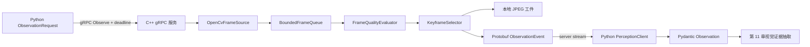

# 第 10 章 观察质量与 gRPC：从连续帧到可追踪 Observation

> 本章把第 9 章持续产生的 `Frame` 收敛成少量、可解释、可取消、可追踪的
> `ObservationEvent`。C++ 仍负责实时像素处理，Python 仍负责业务语义。我们不会在本章
> 偷偷加入 OCR、设备识别或 USB-C 结论。

---

## 1. 本章目标、前提与产物

### 1.1 学习目标

完成本章后，你应当能够解释并实际操作以下内容：

1. 为什么不能把摄像头的每一帧都通过 gRPC 发送给 Python。
2. 如何用 OpenCV 计算清晰度、曝光和抗反光质量，并理解这些量只是启发式指标。
3. 为什么 `target_ratio` 没有可靠目标框时必须保持未知，而不能用中央区域冒充目标。
4. 如何从连续帧中选择一张关键帧，并在全部帧失败时保留可诊断的最佳失败帧。
5. `Frame`、`Observation` 与 `Evidence` 的职责区别。
6. 如何从一个 `.proto` 为 C++ 服务和 Python 客户端生成强类型代码。
7. server-streaming、deadline、显式 `Cancel`、状态码和背压分别解决什么问题。
8. 如何运行一条真实的 C++ 到 Python gRPC 链路，并验证 JPEG 工件确实存在。

### 1.2 学习前提

本章默认你已经完成前九章，尤其要理解：

- 第 3 章的异步服务事件、超时和取消不是模拟界面，而是本章网络行为的概念原型。
- 第 4 章的 `ObservationRequest`、`QualitySignals`、`ObservationEvent.oneof` 和
  `PerceptionRuntime` 服务已经固定字段编号。
- 第 5 章的主动观察流程会产生请求，并可能等待外部观察后恢复。
- 第 6 章只持久化状态和工件引用，不把打开的 gRPC channel 放进 checkpoint。
- 第 7 章的治理预算限制观察次数、外部调用和取消传播。
- 第 8 章建立正式 Python 3.12、uv、CMake、CI 和单仓结构。
- 第 9 章实现 `FrameSource -> BoundedFrameQueue -> FrameConsumer` 的 C++ 连续运行时。

如果你对第 9 章的移动型 `Frame`、`drop_oldest` 和 `stop_token` 还不熟，建议先回看相关
代码。第 10 章不是重新做一个采集程序，而是把观察质量与跨语言边界接到已有运行时上。

### 1.3 本章产物

本章新增或演进以下工程产物：

- `quality_evaluator.hpp/.cpp`：确定性质量测量和逐项拒绝原因。
- `keyframe_selector.hpp/.cpp`：有界内存的关键帧选择。
- `perception_service.hpp/.cpp`：C++ gRPC 服务、取消注册表和事件映射。
- `grpc_server_main.cpp`：本机服务 CLI。
- `contracts/realsight.proto`：只新增源帧追踪字段，不修改旧字段编号。
- `generate_python_proto.py`：生成 Python message、类型 stub 和 gRPC stub。
- `grpc_client.py`：手写 Protobuf/Pydantic 适配、deadline 和流消费。
- `ch10_observation_stream.py`：最小客户端 Demo。
- `run_ch10_demo.py`：一键成功链路与取消链路联调。
- 两组 C++ 算法测试与一组 Python 协议适配测试。
- CI 中的 C++/Python 跨语言联调步骤。

---

## 2. 先明确本章不做什么

第 10 章的输出仍然不是“这个充电器支持 65W PD”的业务证据。它只回答：

> 在本次观察请求期间，C++ 是否找到一张画面质量足够、来源可追踪、可供后续视觉分析的
> 关键帧？

本章不做以下工作：

- 不做 OCR。
- 不从图中抽取 `65W`、`20V=3.25A` 或 `PD`。
- 不识别充电器品牌、型号和真伪。
- 不查询笔记本规格。
- 不执行 USB-C 兼容规则。
- 不调用大模型。
- 不把 C++ 运行时称作 Agent。

这一限制非常重要。若 C++ 在质量筛选时顺便输出 `charger_max_power_w=65`，它就开始承担
第 11 章视觉证据抽取的职责；若 Python 又重复看同一张图，系统会有两个语义来源，冲突
时很难解释谁负责。工程边界不是为了形式整齐，而是为了让错误能被定位。

---

## 3. 从第 9 章 Frame 到第 10 章 Observation

整体链路如下：



数据层次必须分清：

| 类型 | 生命周期 | 主要内容 | 是否跨进程 | 谁负责 |
|---|---|---|---|---|
| `Frame` | 毫秒级 | 原始像素、单调时间、帧序号 | 否 | C++ runtime |
| `FrameQualityResult` | 单帧评估期间 | 原始量、0～1 分数、问题列表 | 否 | C++ quality |
| `SelectedKeyframe` | 一次观察请求期间 | 最佳候选像素、质量、源位置 | 否 | C++ selector |
| JPEG 工件 | 会话/保留策略决定 | 最终关键帧文件 | 以路径引用 | C++ 写入，存储层治理 |
| `ObservationEvent` | RPC 期间 | 进度、最终观察或失败 | 是 | Protobuf/gRPC |
| Pydantic `Observation` | 工作流状态期间 | 经业务校验的观察元数据 | 是，进入 Python 后 | Python adapter |
| `Evidence` | 决策与审计期间 | 字段值、来源、置信度和状态 | 不跨 C++ 边界 | 第 11 章以后 |

`Observation` 是像素世界到证据世界之间的桥，不是证据本身。

---

## 4. 为什么不逐帧跨进程发送视频

第 9 章测试视频只有 `160 x 90`，一张未压缩 BGR 帧约为：

```text
160 x 90 x 3 = 43,200 bytes
43,200 x 20 FPS = 864,000 bytes/s
```

这个数字看起来不大，但 1080p、30 FPS 的未压缩 BGR 数据约为：

```text
1920 x 1080 x 3 x 30 = 186,624,000 bytes/s
```

这还没有计算复制、序列化、内存分配、队列和 Python 对象开销。即使改成 JPEG，也会让
每帧编码成本、网络抖动和 Python 解码积压进入实时路径。

RealSight 采用的原则是：

1. C++ 在采集进程内查看每一帧。
2. C++ 在本地完成质量评分和关键帧选择。
3. 只把低频进度和最终 Observation 元数据发送给 Python。
4. 最终图像保存为本地 JPEG，Observation 只携带路径。
5. 若以后跨主机部署，再把本地路径替换为受控对象存储 URI，而不是发送整段视频。

这并不是说 gRPC 不能传字节。Protobuf 的 `bytes` 完全可以携带 JPEG；这里不这样做，
是因为当前单机架构已经有共享工件目录，路径引用更容易审计和持久化。架构选择要服从
部署事实，不能为了展示协议能力而多复制一次大对象。

---

## 5. 质量评分不是“AI 置信度”

### 5.1 评分的目的

质量评分只负责提前淘汰明显不适合后续视觉分析的帧。它回答的是画面条件，不是语义真假。

例如：

- 一张非常清晰的错误物体照片，质量可以很高，但不能形成充电器证据。
- 一张略有模糊但 OCR 成功的照片，仍可能产生可用证据。
- 一张曝光正常的照片，标签可能被手指遮住。
- 一张目标占比很大的照片，可能只拍到了充电器外壳，没有拍到背面标签。

所以本章的 `overall_score=0.89` 不能被解释成“标签内容有 89% 概率正确”。第 11 章需要
独立记录文字抽取置信度、来源区域和冲突状态。

### 5.2 输入通道与预处理

`FrameQualityEvaluator` 接受 1、3 或 4 通道图像：

- 1 通道复制为灰度，并在需要 HSV 时转为 BGR。
- 3 通道按 OpenCV 默认 BGR 解释。
- 4 通道按 BGRA 转换。
- 其他通道数立即抛出 `invalid_argument`。

OpenCV 官方说明 `cvtColor` 必须明确指定颜色顺序，OpenCV 常用默认顺序实际是 BGR，而
不是名称容易让人误以为的 RGB。[OpenCV 颜色空间转换](https://docs.opencv.org/4.13.0/d8/d01/group__imgproc__color__conversions.html)

这里显式处理通道，避免把 BGRA 当成 BGR 后得到错误亮度和饱和度。

---

## 6. 四个质量信号如何计算

### 6.1 清晰度 sharpness

代码先把图像转成灰度，再计算 Laplacian 响应，最后取响应的方差：

```text
laplacian_variance = variance(Laplacian(gray))
sharpness = clamp(laplacian_variance / sharpness_reference, 0, 1)
```

默认 `sharpness_reference=500`，最低接受分数为 `0.12`。OpenCV 的 `Laplacian` 计算图像
在 x、y 方向二阶导数之和，可突出快速变化的边缘。[OpenCV Laplace Operator](https://docs.opencv.org/4.12.0/d5/db5/tutorial_laplace_operator.html)

“Laplacian 响应方差越大通常越清晰”是本项目采用的启发式，不是适用于所有镜头和纹理的
物理定律。以下情况会误导它：

- 标签本身大面积纯色，真实对焦正确但边缘很少。
- 图像噪声很多，方差高但并不清晰。
- 画面包含复杂背景，背景边缘很清晰，目标标签却模糊。
- 分辨率、缩放和相机锐化不同，原始方差不可直接横向比较。

因此默认值只适合课程 Demo。真实设备要按分辨率、相机和标签数据集校准。

### 6.2 曝光 exposure

只看平均亮度会漏掉“一半全黑、一半全白”的严重截断图像。本项目同时计算：

```text
mean_luminance       = mean(gray)
dark_pixel_ratio     = ratio(gray <= 15)
bright_pixel_ratio   = ratio(gray >= 240)
centered_brightness  = 1 - abs(mean_luminance - 127.5) / 127.5
clipping_quality     = 1 - max(dark_pixel_ratio, bright_pixel_ratio)
exposure             = clamp(0.6 * centered_brightness
                             + 0.4 * clipping_quality, 0, 1)
```

最低接受分数为 `0.45`。若曝光分数不足，再根据平均亮度低于还是高于 `127.5`，分别记录
`underexposed` 或 `overexposed`。

这个公式的好处是可解释、无需模型、可稳定测试；缺点是它没有考虑局部标签区域。如果背景
很暗而标签曝光正常，全局分数可能偏低。后续有可信目标框后，可以只对 ROI 评估曝光。

### 6.3 抗反光质量 glare

字段名 `glare` 容易产生方向歧义。本课程统一规定：

> `QualitySignals.glare` 表示抗反光质量，0 最差，1 最好。

代码把 BGR 转成 HSV，把 `V >= 245` 且 `S <= 40` 的像素视为可能的白色高亮反光：

```text
glare_pixel_ratio = ratio(value >= 245 and saturation <= 40)
glare_quality = clamp(1 - glare_pixel_ratio / 0.08, 0, 1)
```

OpenCV 的 `inRange` 可以根据 HSV 上下界生成二值掩码。[OpenCV inRange 教程](https://docs.opencv.org/master/da/d97/tutorial_threshold_inRange.html)

这里检测的是一种常见高亮形态，并不能覆盖彩色反射、局部镜面边缘或屏幕内容。把指标
命名为“抗反光质量”并在协议注释中固定方向，能避免第 4 章示例写 `0.08` 表示“低反光”、
第 10 章又写 `0.08` 表示“质量很差”的语义冲突。本次实现已经把旧示例统一为高分代表好。

### 6.4 目标占比 target_ratio

公式本身很简单：

```text
target_ratio = target_region.area / frame.area
```

困难不在除法，而在 `target_region` 从哪里来。第 10 章没有目标检测器，也没有稳定追踪器。
若直接取画面中央 50% 并称为“目标”，系统就会输出看起来精确、实际没有依据的数字。

因此实现采用严格规则：

- 调用方提供了完全位于画面内的可信 ROI，才计算 `target_ratio`。
- ROI 越界、宽高非正，立即拒绝。
- 没有 ROI 时，`target_ratio = nullopt`，Protobuf optional 字段不出现，Python 为 `None`。
- 没有计算的 `None` 与真实占比 `0.0` 不相同。

当前 gRPC 服务没有接目标跟踪器，所以真实 Demo 中该字段就是 `null`。这是正确的能力边界，
不是未完成的假数据填充。

### 6.5 总分与逐项门槛

没有 ROI 时总分为：

```text
overall = 0.45 * sharpness + 0.35 * exposure + 0.20 * glare
```

有 ROI 时增加 `0.15 * target_ratio`，再除以总权重 `1.15`。

但是接受帧不能只看总分。假设清晰度为 1、曝光为 1、抗反光质量为 0，总分仍有 0.8；
若只看总分，严重反光帧会被其他高分掩盖。所以实现要求每一项分别通过最低门槛：

| 参数 | 默认值 | 含义 |
|---|---:|---|
| `sharpness_reference` | 500.0 | Laplacian 方差归一化参考 |
| `minimum_sharpness` | 0.12 | 低于则 `blurry` |
| `minimum_exposure` | 0.45 | 低于则过暗或过亮 |
| `minimum_glare_quality` | 0.40 | 低于则 `glare` |
| `minimum_target_ratio` | 0.15 | 只在有 ROI 时使用 |
| `maximum_glare_pixel_ratio` | 0.08 | 达到该高亮比例时反光质量降为 0 |

`accepted = issues.empty()`。这使拒绝理由可审计，也便于主 Agent 在后续决定“请靠近一点”、
“请减少反光”还是“请重新对焦”。

---

## 7. 关键帧选择：只保留必要像素

### 7.1 两个候选而不是一个

`KeyframeSelector` 同时维护：

- `best_accepted`：所有通过逐项门槛的帧中，总分最高的一张。
- `best_overall`：不论是否合格，总分最高的一张。

最终选择规则：

```text
if best_accepted exists:
    return best_accepted
else:
    return best_overall
```

为什么失败时仍保留一张？因为“没有合格帧”不应只返回一句模糊的失败文本。保存最佳失败帧
后，用户、测试人员或后续诊断界面能看到是过暗、反光还是完全拍错。它仍然以
`OBSERVATION_STATUS_REJECTED` 返回，并携带 `failure_reason`，不能被当作成功观察。

### 7.2 有界内存

选择器不会缓存所有帧。每一帧完成评分后：

1. 更新 evaluated/accepted/rejected 计数。
2. 只有分数严格高于旧候选时，才 `clone()` 当前像素。
3. 旧候选释放。
4. 请求结束时最多保留两张候选图。

这与第 9 章移动型 `Frame` 的所有权设计一致。普通帧经过消费者后立即释放，只有真正可能
成为最终关键帧的像素发生显式复制。

### 7.3 当前选择器没有做什么

本章只选一张静态最佳帧，没有做：

- 相邻帧感知哈希去重。
- 标签正面、背面、接口三个语义视角的多样性选择。
- 目标轨迹稳定性。
- OCR 可读性回馈。
- 多关键帧预算优化。

这些不是遗漏，而是请求语义决定的范围。一次 `BACK_LABEL` ObservationRequest 当前只需要
一张最佳背标帧；若将来一个请求需要多视角，应显式修改请求与结果契约，而不是让选择器
暗中返回不定数量图片。

---

## 8. 源追踪字段与协议兼容

第 4 章已固定 Observation 的 1 到 11 号字段。本章只追加：

```protobuf
optional uint64 source_frame_sequence = 12;
optional int64 source_position_ms = 13;
```

这两个字段分别回答：

- 关键帧是本次 C++ 源流中的第几帧。
- 对视频文件而言，它大约位于源文件多少毫秒。

摄像头通常没有可回放的视频位置，因此 `source_position_ms` 可以缺失。字段编号一旦在线路上
使用就不能随意修改或复用；Protobuf 官方指南明确说明字段编号是二进制 wire format 的身份，
删除字段后也应保留编号，避免未来复用。[Proto3 Language Guide](https://protobuf.dev/programming-guides/proto3/)

本章没有把字段 12 改成其他含义，也没有重排低编号。旧客户端读到新消息时会忽略未知字段；
新客户端读旧消息时会得到 optional 缺失。这个演进方式比同时发布一份完全不同的
`realsight_v2.proto` 更适合当前增量变化。

---

## 9. 一个 .proto，两个语言的生成代码

### 9.1 C++ 生成流程

CMake 配置后，构建图执行：

```text
contracts/realsight.proto
    -> protobuf::protoc --cpp_out
    -> grpc_cpp_plugin --grpc_out
    -> build/.../cpp/generated/realsight.pb.*
    -> build/.../cpp/generated/realsight.grpc.pb.*
    -> realsight_proto target
```

生成代码位于 `build`，不进入手写源码目录。`realsight_proto` 链接
`protobuf::libprotobuf` 和 `gRPC::grpc++`。

### 9.2 Python 生成流程

Python 使用锁定版本的 `grpcio-tools`：

```powershell
uv run --locked python scripts/generate_python_proto.py
```

脚本生成：

- `realsight_pb2.py`：运行时 message/enum/descriptor。
- `realsight_pb2.pyi`：静态类型接口。
- `realsight_pb2_grpc.py`：stub 与 service helper。

生成器会修正包内导入，并在文件顶部添加“生成代码不要手改”的中文说明。`.pyi` 很重要：
没有它，Protobuf 动态生成的属性对 mypy 不可见，手写客户端会出现大量“模块没有该字段”
的假错误。

### 9.3 哪些代码应该学习

优先阅读顺序：

1. `contracts/realsight.proto`，理解跨语言契约。
2. `grpc_client.py`，理解手写业务适配。
3. `perception_service.cpp`，理解服务端编排。
4. CMake 代码生成命令，理解 build graph。
5. 生成文件只需知道它们存在，不需要逐行学习 descriptor bytes。

把生成文件逐行注释既浪费时间，也会在下一次生成时丢失。真正的工程能力是知道协议源、
生成步骤、手写边界和漂移检查分别在哪里。

---

## 10. 为什么使用 server-streaming

服务契约是：

```protobuf
service PerceptionRuntime {
  rpc Observe(ObservationRequest) returns (stream ObservationEvent);
  rpc Cancel(CancelObservationRequest) returns (CancelObservationResponse);
}
```

一次观察在最终结果前可能经历多个阶段：

```text
request_accepted
source_opened
scanning
keyframe_selected
Observation 或 Failure
```

若使用普通 unary RPC，Python 在几秒内只知道“还没返回”，无法向用户展示真实阶段，也无法
在日志中定位服务卡在打开摄像头还是扫描帧。server-streaming 让客户端发送一个请求，再按
写入顺序读取多个结果。gRPC C++ 基础教程将其定义为客户端发送一个请求、读取响应流直到
结束。[gRPC C++ Basics](https://grpc.io/docs/languages/cpp/basics/)

本项目没有使用双向流，因为观察指令在一次 RPC 开始后不需要持续变化。额外取消通过独立
unary `Cancel` 完成。将来若要在同一长连接中连续发送动态视角指令，才应评估双向流。

---

## 11. C++ 同步 gRPC API 的选择与限制

gRPC C++ 官方最佳实践当前推荐 callback API，并强调 RPC 应设置 deadline。
[gRPC C++ Best Practices](https://grpc.io/docs/languages/cpp/best_practices/)

本章仍使用同步 `ServerWriter`，原因是当前验收范围明确为：

- 单摄像头。
- 单目标。
- 一个活动 Observe。
- 本机进程间通信。
- 低频事件，而不是高吞吐数据流。

同步实现让初学者先看清：请求校验、帧运行时、质量筛选、事件写入、取消传播和状态码。若
本章同时引入 Reactor 生命周期、只能有一个 write in flight、`OnWriteDone`、`OnCancel`
与跨线程队列，学习重点会被异步框架细节淹没。

但必须诚实记录限制：

- 服务主动拒绝第二个并发 Observe，返回 `RESOURCE_EXHAUSTED`。
- 同步 handler 会占用一个 gRPC 服务线程直到观察结束。
- 多摄像头、多租户或高并发部署应迁移 callback API。
- 迁移时还需要设备租约、每会话队列、并发预算和负载测试，不只是替换一个基类。

“当前选择足以满足受限 MVP”与“这是任何规模下的最佳实现”是两种完全不同的结论。

---

## 12. deadline、应用超时和显式取消

### 12.1 客户端 deadline

Python 调用：

```python
call = stub.Observe(
    request_to_proto(request),
    timeout=request.timeout_ms / 1_000,
    wait_for_ready=True,
)
```

gRPC 默认不自动设置 deadline，客户端可能无限等待；官方 deadline 指南建议客户端始终
设置符合业务的截止时间。[gRPC Deadlines](https://grpc.io/docs/guides/deadlines/)

这里 `timeout_ms` 同时写入协议并用于 RPC deadline：

- 协议字段让 C++ 即使面对未正确设置 deadline 的其他客户端也有应用预算。
- gRPC deadline 让 Python 网络调用不会无限等待。

二者不是重复浪费，而是服务自我保护与客户端等待上限两个边界。

### 12.2 显式 Cancel RPC

用户主动取消任务时，Python 调用：

```python
accepted = client.cancel(request_id, reason)
```

C++ 在受 mutex 保护的 `active_requests` 中查找同 ID 的 `stop_source`，调用
`request_stop()`。帧消费者在下一次帧边界停止，第 9 章运行时关闭队列并 join 采集线程。

真实取消 Demo 已验证：

```text
source_opened
cancel_requested accepted=true
failure code=cancelled
gRPC status=CANCELLED
```

gRPC 官方取消指南指出，库不能任意中断正在执行的应用 handler；长任务必须主动检查取消
并停止本地计算。[gRPC Cancellation](https://grpc.io/docs/guides/cancellation/)

### 12.3 设备阻塞边界

若某个摄像头驱动永久阻塞在 `VideoCapture::read()`，C++20 `stop_token` 不能从外部强制
终止第三方驱动调用。当前实现会在该次读取返回后观察取消。这一限制从第 9 章延续而来。

生产设备层可采用：

- 驱动自身的超时配置。
- 独立设备进程，超时后重启进程。
- 平台原生可取消采集 API。
- 看门狗与设备健康状态。

不要用 `std::terminate` 或强杀线程来假装解决资源释放问题。

---

## 13. 背压为什么仍然重要

同步 `ServerWriter::Write` 在客户端读取慢时可能阻塞。由于 Write 发生在帧消费者线程，生产者
仍可继续从摄像头采集；第 9 章有界队列会按 `drop_oldest` 丢弃旧帧，使消费者恢复后处理
较新的现实状态。

本章进一步减少背压概率：

- 不逐帧发送事件。
- 默认每 10 个已评估帧才发送一次 scanning 进度。
- 最终只发送一条 Observation。
- 像素不进 Protobuf。

因此背压链路是：

```text
Python 读取慢
-> C++ ServerWriter::Write 阻塞
-> FrameConsumer 暂停
-> BoundedFrameQueue 达到容量
-> drop_oldest 丢弃旧帧
-> Python 恢复读取
-> C++ 继续处理较新帧
```

这是实时感知与离线批处理的核心区别。离线任务可能要求每帧必达；主动观察更关心当前清晰
画面，积压一秒前的模糊帧通常没有价值。

---

## 14. 错误、失败和拒绝不是同一件事

本章有三层结果：

| 场景 | 事件/状态 | 含义 |
|---|---|---|
| 找到合格帧 | Observation `ACCEPTED` + gRPC `OK` | 正常成功 |
| 有帧但全不合格 | Observation `REJECTED` + gRPC `OK` | 传输成功，业务观察不足 |
| 源没有帧 | Failure `no_frames` + gRPC `OK` | 服务完成，但没有观察结果 |
| 请求字段非法 | gRPC `INVALID_ARGUMENT` | 输入在任何运行状态下都不合法 |
| 已有活动观察 | gRPC `RESOURCE_EXHAUSTED` | 当前单设备租约被占用 |
| 显式取消 | Failure `cancelled` + gRPC `CANCELLED` | 调用方中止任务 |
| 应用超时 | Failure `deadline_exceeded` + gRPC `DEADLINE_EXCEEDED` | 观察预算耗尽 |
| 运行时内部错误 | Failure `runtime_error` + gRPC `INTERNAL` | 服务实现或消费异常 |
| 视频/摄像头/工件不可用 | Failure + gRPC `UNAVAILABLE` | 外部资源暂时不可用 |

尤其要注意：画面反光导致 `REJECTED` 不是网络错误。Python 应把它交给主动观察流程，产生
“请调整角度”的下一步，而不是盲目重连 gRPC。

---

## 15. 本地工件路径与安全边界

最终关键帧写入：

```text
<artifact_root>/<request_id>/keyframe.jpg
```

失败最佳帧写入：

```text
<artifact_root>/<request_id>/rejected-best.jpg
```

OpenCV `imwrite` 根据扩展名选择编码器并返回成功或失败。
[OpenCV imwrite](https://docs.opencv.org/4.13.0/d4/da8/group__imgcodecs.html)

因为 `request_id` 来自网络，服务在路径拼接前执行白名单校验：

```text
首字符：字母或数字
后续字符：字母、数字、点、下划线、短横线
长度：1～128
```

这样 `../outside`、绝对路径和路径分隔符不能进入工件路径。Pydantic 已经校验 Python 请求，
但 C++ 不能假设所有客户端都经过 Python，因此必须在服务边界再校验。

当前 `image_path` 是本机绝对路径，只适合 C++ 与 Python 共享文件系统。若跨机器部署：

- C++ 应上传到对象存储或由工件服务接管。
- Observation 应携带受控 URI、内容哈希、大小和媒体类型。
- 下载端应验证 scheme、允许的 host、大小限制和哈希。
- 不应把任意服务端路径暴露给浏览器。

这些属于后续部署强化，不在单机一个月 MVP 中伪装完成。

---

## 16. Python 适配器为什么不能省略

生成的 `realsight_pb2.Observation` 只能证明 wire 字段能被解析，不能自动证明：

- `schema_version` 是课程支持的 1。
- `view_type` 不是 `UNSPECIFIED`。
- `captured_at_unix_ms` 存在且为正数。
- `quality.overall_score` 存在并处于 0～1。
- 成功状态没有 `failure_reason`。
- 拒绝状态一定有 `failure_reason`。
- event 与 payload 的 `request_id` 一致。

所以 `grpc_client.py` 显式执行：

```text
Protobuf ObservationEvent
-> 校验 event envelope
-> WhichOneof(payload)
-> 映射 enum
-> 检查 optional presence
-> Unix ms 转 UTC datetime
-> 构造 Pydantic Observation
-> Pydantic 再执行聚合约束
```

进度和失败映射成只读 dataclass；最终 Observation 映射成第 4 章稳定 Pydantic 类型。该
channel 和 stub 只存在于运行时对象，绝不能保存进 LangGraph checkpoint。

---

## 17. 运行本章 Demo

### 17.1 环境准备

Windows 主环境使用 MSYS2 UCRT64。需要 OpenCV 和 gRPC 开发包：

```powershell
E:\msys64\usr\bin\pacman.exe -S --needed `
  mingw-w64-ucrt-x86_64-opencv `
  mingw-w64-ucrt-x86_64-grpc
```

项目环境和生成代码：

```powershell
uv sync --locked --all-groups
uv run --locked python scripts/generate_python_proto.py
uv run --locked realsight-doctor
```

本次验证的主要版本是：

```text
Python 3.12
GCC 16.2.0
CMake 4.4.2
OpenCV 5.0.0
C++ gRPC 1.82.0
C++ Protobuf/protoc 35.1.0
Python grpcio 1.83.0
Python grpcio-tools 1.81.1
Python protobuf 6.33.6
```

### 17.2 编译和 CTest

```powershell
uv run --locked cmake --preset windows-gcc-debug
uv run --locked cmake --build --preset windows-gcc-debug
uv run --locked ctest --preset windows-gcc-debug
```

预期有六个 CTest：

```text
realsight-runtime-info
realsight-frame-queue
realsight-perception-runtime
realsight-opencv-source
realsight-quality-evaluator
realsight-keyframe-selector
```

### 17.3 一键成功链路

```powershell
uv run --locked python scripts/run_ch10_demo.py
```

脚本会生成 24 帧 AVI、选择空闲 loopback 端口、启动一次性 C++ 服务，再运行 Python
客户端。关键输出示例：

```text
SERVER_READY address=127.0.0.1:54381 selected_port=54381
stage=request_accepted progress=0
stage=source_opened progress=5
stage=scanning evaluated=6 accepted=4
stage=scanning evaluated=12 accepted=8
stage=scanning evaluated=18 accepted=<随编解码与队列时序变化>
stage=scanning evaluated=24 accepted=<随编解码与队列时序变化>
stage=keyframe_selected selected source frame <本次最佳候选序号>
kind=observation status=accepted source_frame_sequence=<序号> source_position_ms=<位置>
quality sharpness=1.0 exposure=0.696 glare=0.977 overall=0.889
target_ratio=null
CH10_DEMO_OK transport=cpp_to_python artifact=verified
```

时间戳、端口、文件大小和具体帧分数会随机器与编解码器变化，不能把示例数字写成测试常量。
应验证的是事件顺序、最终状态、字段范围和工件存在。

### 17.4 一键取消链路

```powershell
uv run --locked python scripts/run_ch10_demo.py --verify-cancel
```

预期关键输出：

```text
stage=source_opened
kind=cancel_requested accepted=true
kind=failure code=cancelled retryable=true
CANCEL_DEMO_OK code=CANCELLED server_stop=verified
CH10_CANCEL_OK cancel_rpc=accepted status=CANCELLED
```

### 17.5 手动双终端方式

理解一键脚本后，可以手动运行。

终端 A：

```powershell
build\windows-gcc-debug\cpp\realsight-perception-grpc.exe `
  --video runtime-data\ch10-demo.avi `
  --listen 127.0.0.1:50051 `
  --artifacts runtime-data\ch10-artifacts `
  --max-frames 24 `
  --no-realtime
```

终端 B：

```powershell
uv run --locked python examples/ch10_observation_stream.py `
  --address 127.0.0.1:50051
```

不要把默认 insecure 服务暴露到 `0.0.0.0`。当前没有 TLS 和身份认证，它只适合受信任本机。

---

## 18. 测试如何分层

### 18.1 C++ 质量测试

`quality_evaluator_test.cpp` 使用确定性合成图：

- 40～210 的随机纹理应有较高清晰度并被接受。
- 纯黑图应包含 `underexposed`。
- 纯白图应包含 `overexposed` 和 `glare`。
- 80 x 60 ROI 位于 160 x 120 图时，占比应为 0.25。
- 越界 ROI 必须抛出异常。

合成图测试验证公式方向与边界，不证明真实摄像头阈值合适。

### 18.2 C++ 关键帧测试

`keyframe_selector_test.cpp` 验证：

- 坏帧后出现好帧时，最终选择好帧。
- 源帧序号和视频位置不丢失。
- accepted/rejected 分开计数。
- 全部失败时不声称成功，但保留诊断候选。

### 18.3 Python 协议测试

`test_ch10_grpc_adapter.py` 验证：

- `correlation_id` optional presence。
- progress event 转成带 UTC 时间的 dataclass。
- `target_ratio` 未设置时保持 `None`。
- 源帧追踪字段进入 Pydantic Observation。
- 空 oneof 和 request_id 不一致被拒绝。
- 生成文件有教学头部。
- gRPC 只进入 transport target，不污染 runtime。
- doctor 能发现真实 protoc、grpc_cpp_plugin 与 Python grpcio。

### 18.4 跨语言联调

`run_ch10_demo.py` 不是单元测试替代品。它验证单元测试无法证明的边界：

- C++ server 可以加载 DLL 并绑定端口。
- Python 与 C++ 的生成代码 wire 兼容。
- 事件真的跨进程到达。
- 本地路径编码可被 Python 解析。
- JPEG 真的写入。
- Cancel RPC 真的停止活动请求。

CI 的 C++ job 会安装 OpenCV/gRPC/Protobuf，构建、执行 CTest，再运行成功链路 Demo。

---

## 19. 常见问题与排查顺序

### 19.1 CMake 找不到 ZLIB 或 OpenSSL

MSYS2 的 gRPC CMake target 会引用 `ZLIB::ZLIB` 和 `OpenSSL::SSL`。本项目从实际
`CMAKE_CXX_COMPILER` 路径推导 UCRT64 前缀，不硬编码 `E:`。若仍失败：

1. 确认当前 `g++`、OpenCV、gRPC 都来自同一个 UCRT64 前缀。
2. 运行 `realsight-doctor`。
3. 删除对应 build 目录后重新配置，避免旧 cache 指向另一套编译器。
4. 不要混用 MSYS、MINGW64、UCRT64 和 Visual Studio 库。

### 19.2 找不到 grpc_cpp_plugin

Python `grpcio-tools` 能生成 Python 代码，不等于系统有 C++ `grpc_cpp_plugin`。安装
MSYS2 的 `mingw-w64-ucrt-x86_64-grpc`，并确认其 `bin` 在 PATH。

### 19.3 服务 ready，但客户端连接失败

依次检查：

- address 与端口是否一致。
- 服务是否因 `--once` 已经处理过一个请求并退出。
- 防火墙是否阻止 loopback。
- 客户端 deadline 是否过短。
- 是否有旧服务占用端口。

一键脚本每次选择空闲端口，优先用它排除固定端口冲突。

### 19.4 target_ratio 为什么是 null

因为没有可信目标框。不要为了让字段“好看”而填默认值。第 11 章可直接分析整张关键帧；
未来加入目标检测/跟踪后，再把可信 ROI 注入质量评估器。

### 19.5 Windows 出现 GLib-GIO warning

本机 OpenCV 5 后端可能在进程结束时输出 Windows AppX manifest 相关 GLib-GIO warning。
若 CTest、gRPC 状态、JPEG 和进程退出码均成功，该 warning 不代表 RealSight 业务失败。
仍应记录环境和 OpenCV 构建版本，升级工具链后复查，不能无条件屏蔽所有 stderr。

### 19.6 生成代码被手改后又消失

这是预期。修改 `.proto` 或手写适配器，然后重新运行生成脚本。CI 会重新生成并检查 Git
差异，防止契约改了、stub 没更新。

---

## 20. 企业工程对齐与剩余差距

本章与 2026 企业工程实践对齐的部分包括：

- 单一 `.proto` 协议源与跨语言生成。
- additive 字段演进和 optional presence。
- 业务模型与 wire model 显式适配。
- 客户端 deadline、服务端应用预算和显式取消。
- 状态码与业务拒绝分离。
- 有界队列与实时丢旧策略。
- target-based CMake 依赖，不全局注入 include/lib。
- Debug/Release 都有效的显式测试检查。
- 生成代码漂移 CI 检查。
- C++/Python 跨进程集成测试。
- 本地工件路径经过 ID 白名单约束。

本章没有达到生产级的部分也必须列出：

- 质量阈值没有用真实充电器数据集校准。
- 没有物理摄像头自动化矩阵。
- 没有目标检测和跟踪，因此 target_ratio 缺失。
- 同步 gRPC 只支持单活动观察，不适合高并发。
- 只有本机 insecure channel，没有 TLS、mTLS 或服务身份。
- 工件没有内容哈希、媒体元数据和生命周期清理。
- 本地绝对路径不能用于跨主机部署。
- 没有吞吐、P95 延迟、内存和长时间稳定性基准。
- 摄像头驱动阻塞不能由 stop_token 强制中断。
- 没有 gRPC health checking、reflection、指标导出和分布式 tracing。

这些差距不是要求你在一个月内全部补齐，而是帮助你在面试或评审中准确表达：当前是经过
工程验证的教学 MVP，不是已经完成合规、扩缩容和设备矩阵的产品。

---

## 21. 代码阅读路线

建议按以下顺序阅读，每次只追一条调用链：

1. `quality_evaluator_test.cpp`，先从输入和期望理解分数方向。
2. `quality_evaluator.cpp`，对照公式找到 OpenCV 调用。
3. `keyframe_selector_test.cpp`，理解两个候选的原因。
4. `keyframe_selector.cpp`，观察何时 clone 像素。
5. `realsight.proto`，看稳定消息与 service。
6. `perception_service.cpp`，追 `Observe` 成功路径。
7. 再追同一函数的取消、超时和失败路径。
8. `grpc_client.py`，看 Protobuf 到 Pydantic 的逐字段适配。
9. `ch10_observation_stream.py`，看调用者如何消费三种事件。
10. `run_ch10_demo.py`，理解自动化如何启动两个进程并验证结果。
11. `cpp/CMakeLists.txt`，最后看代码生成和 target 依赖图。

不要一开始阅读 `realsight_pb2.py` 中的 descriptor bytes。那是工具产物，不是理解系统的
最佳入口。

---

## 22. 课后练习

### 练习 1：打印原始质量量

给 `realsight-perception` 增加一个只用于调试的 JSON 输出，打印
`laplacian_variance`、`mean_luminance`、`dark_pixel_ratio` 和 `glare_pixel_ratio`。

要求：

- 不改变 Protobuf 稳定字段。
- 不把逐帧日志默认打开。
- 能用参数控制采样间隔。

### 练习 2：制作四段质量视频

扩展测试视频生成器，依次生成：模糊、过暗、强反光、正常四段画面。运行 gRPC Demo，
观察 accepted 计数和最终关键帧是否符合预期。

要求：不能用 Python OpenCV 代替 C++ 生成器，否则没有覆盖当前 C++ 编解码路径。

### 练习 3：验证 rejected Observation

制作全黑视频，确认最终返回：

- `status=rejected`
- `failure_reason` 包含 `underexposed`
- `image_path` 指向 `rejected-best.jpg`
- gRPC 状态仍是 `OK`

解释为什么它不是 `INTERNAL`。

### 练习 4：校准而不是猜阈值

采集至少 20 张标签照片，人工标注“可读/不可读”，导出四个质量量。不要立刻训练模型，
先画分布并观察默认阈值在哪些样本上误判。

交付：一页阈值选择说明，而不是只提交新数字。

### 练习 5：实现可信 ROI 注入设计

只写设计，不立即改协议。说明目标框可能来自：用户框选、传统跟踪器、目标检测器或上一帧
状态。比较它们的来源可信度、失效条件和如何写入 Observation 追踪信息。

### 练习 6：增加 gRPC 错误测试

构造非法 `schema_version=0` 请求，确认服务返回 `INVALID_ARGUMENT`。再并发发送两个 Observe，
确认第二个返回 `RESOURCE_EXHAUSTED`，且不会删除第一个请求的取消令牌。

### 练习 7：阅读 callback API

阅读 gRPC C++ callback 最佳实践，画出若迁移本服务时需要的状态：事件队列、write in flight、
`OnWriteDone`、`OnCancel`、worker stop 和 `OnDone` 自删除。只画生命周期图，不急于改代码。

---

## 23. 本章验收清单

### 逻辑

- [ ] 能解释 Frame、Observation、Evidence 的边界。
- [ ] 能解释为什么逐项门槛不能被 overall score 替代。
- [ ] 能解释 target_ratio 缺失为何比伪造默认值更正确。
- [ ] 能区分 rejected Observation 与 gRPC error。

### 技术栈

- [ ] 能说明 OpenCV 各函数在本章的用途。
- [ ] 能说明 Protobuf、gRPC、Pydantic 各自负责什么。
- [ ] 能说明同步 gRPC 的适用范围和迁移条件。
- [ ] 能说明 CMake 为什么分成 runtime、proto、transport targets。

### Demo

- [ ] 六个 CTest 全部通过。
- [ ] Python 全量测试通过。
- [ ] 成功 Demo 输出 `CH10_DEMO_OK`。
- [ ] 取消 Demo 输出 `CH10_CANCEL_OK`。
- [ ] Python 能找到 Observation 指向的 JPEG。

### 桥接

- [ ] Observation 保留 request_id、target_id、view_type 和源帧位置。
- [ ] channel/stub 没有进入 checkpoint state。
- [ ] 本章没有提前生成 OCR Evidence。
- [ ] 能说出第 11 章从哪个文件路径和哪些质量字段开始工作。

---

## 24. 到第 11 章的桥接

第 11 章“视觉证据子 Agent”接收的不是视频流，而是经过本章筛选的 Pydantic Observation：

```text
Observation
  observation_id
  request_id
  target_id
  view_type=back_label
  image_path=.../keyframe.jpg
  quality.overall_score
  quality.sharpness/exposure/glare
  source_frame_sequence/source_position_ms
  status=accepted
```

第 11 章需要完成：

1. 读取并验证 `image_path` 指向的图片。
2. 根据 ObservationRequest.required_features 决定要抽取哪些字段。
3. 使用 OCR 或多模态模型抽取标签文字。
4. 保留文本区域、原始字符串、标准化结果和来源 Observation ID。
5. 将抽取结果转成 `Evidence`，而不是修改 Observation。
6. 若内容不可读或冲突，返回证据缺口，让主流程再次主动观察。

本章已经为它提供稳定输入，但不会替它断言标签内容。这样第 11 章可以专注“从关键帧到
结构化证据”，不再承担摄像头帧率、队列、反光筛选和跨语言传输。

---

## 25. 本章小结

第 9 章让 C++ 能持续看见现实；第 10 章让它知道哪些画面值得交给 Python，并用真实 gRPC
把结果送出去。

本章最重要的不是某个清晰度公式，而是四条工程原则：

1. 高频像素留在 C++，跨进程只传低频结构化结果。
2. 质量指标必须可解释、方向一致，并诚实保留未知。
3. Observation 是可追踪观察，不是语义 Evidence。
4. 网络调用必须有 deadline、取消、错误语义和有界资源策略。

至此，RealSight 已经有了一条可运行的主动感知输入链：Python 请求视角，C++ 采集和筛选，
Python 收到可恢复工作流能够消费的 Observation。下一章将第一次真正“看懂”关键帧中的
USB-C 标签，但仍要把每个结论绑定到本章留下的来源和质量信息上。
