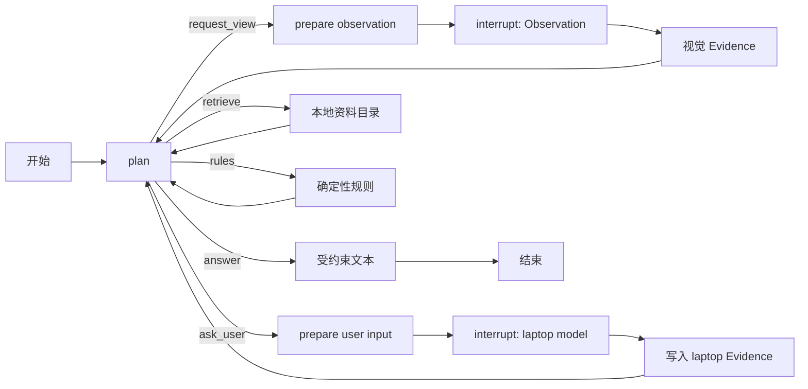

# 第 13 章：主 Agent 与完整证据循环

## 1. 本章目标、前提与产物

第 12 章已经能回答一个窄而严肃的问题：在**已给出的**充电器功率、协议和笔记本规格
都可信时，静态 USB-C 条件是否满足。现实任务并不会把这五条输入整齐地放在函数参数
里。你通常先看到一个充电器，标签可能反光，笔记本型号可能还在用户手中，资料目录也
可能查不到。第 13 章要补上的不是“更会聊天的模型”，而是把这些不完整的事实组织为可
规划、可暂停、可恢复、可追踪的循环。

完成本章后，你应能解释并运行这条链：

```text
主 Agent 选择下一动作
  -> 请求充电器背面标签，或询问笔记本型号
  -> LangGraph 保存 checkpoint 并 interrupt
  -> 外部世界提交 Observation 或用户输入
  -> 视觉子 Agent / 规格目录 / 规则引擎处理
  -> 主 Agent 根据新的证据状态再次规划
  -> 输出受规则约束的说明和未知边界
```

本章产物：

- `python/src/realsight/workflow/models.py`：双现实对象状态与暂停载荷。
- `python/src/realsight/workflow/planner.py`：离线规划器和 OpenAI 规划器。
- `python/src/realsight/workflow/main_agent.py`：LangGraph 主循环。
- `python/src/realsight/workflow/replay.py`：回放与 C++ gRPC 感知端口。
- `examples/ch13_main_agent_loop.py`：两次暂停恢复的离线 Demo。
- `python/tests/test_ch13_main_agent_loop.py`：四项确定性测试。

前提是你已理解第 4 章的 `Action`/`RunEvent`，第 5、6 章的 interrupt/checkpoint，
以及第 11、12 章的 Evidence、规格检索和规则边界。不需要先有 OpenAI Key；默认
Demo 完全离线。

## 2. 为什么主 Agent 不是“所有组件的总称”

本项目只有主 Agent 负责回答“下一步该补哪一种证据”。C++ 运行时负责采集、质量判定
和关键帧，不是 Agent；视觉子 Agent 负责从一张已合格的标签图生成候选 Evidence，也
不决定兼容性；资料目录负责精确匹配；规则引擎负责功率和协议比较。它们的边界如下：

| 组件 | 可做 | 不可做 |
|---|---|---|
| 主 Agent | 规划下一动作、判断是否仍有证据缺口 | 伪造标签、猜型号、替代规则结论 |
| C++ 感知运行时 | 连续帧、质量、关键帧、gRPC Observation | OCR、知识检索、USB-C 判断 |
| 视觉 Evidence Agent | 标签文本变为有来源 Evidence 或 gap | 控制摄像头、宣称硬件兼容 |
| 规格目录 | 精确查资料并生成来源 Evidence | 模糊猜测型号 |
| 规则引擎 | 计算 `conditions_met` 等分支 | 代表真实设备已开始充电 |

这套拆分和深度研搜的关系是：主 Agent 是研究计划者，视觉与资料模块是专业工具，
Evidence Ledger 是可复核的研究笔记，规则引擎是不能由自然语言覆盖的计算约束。

## 3. 两个现实对象，不能共用一个 BeliefState

`BeliefState` 的 `target_id` 是硬约束。充电器背面标签得到的
`charger_max_power_w=65` 属于充电器；用户输入的 `laptop_model=ExampleBook 13` 属于
笔记本；目录派生的最小功率、推荐功率和协议仍属于笔记本。若把后四项全塞进充电器
`BeliefState`，系统表面上更省事，但审计时会失去“这条事实到底属于谁”的答案。

`MainAgentState` 因此继承而非改名 `RealSightGraphState`，新增：

```text
target / belief                       充电器 RealityObject 与证据账本
laptop_target                         另一个笔记本 RealityObject
laptop_model_evidence                 用户确认的型号事实
laptop_specification_evidence         目录返回的三条资料事实
lookup_status                         found / not_found / ambiguous / invalid_query
compatibility_result                  第 12 章的确定性结果
final_answer                          只复述结果、证据与未知边界的文本
```

这里有一个容易误解的细节：第 4 章的 `Action.target_id` 在本课程仍表示**当前主任务
目标**，即充电器。因此“请提供笔记本型号”的 `ASK_USER` Action 仍属于该任务；真正的
笔记本 Evidence 会在恢复后写入 `laptop_target`。这样没有偷偷修改旧契约，同时双目标
边界仍是可检查的。

## 4. 双模式规划器：模型负责选路，模型不拥有副作用

`Planner` 是一个很小的协议：`plan(state) -> Action`。离线时用
`DeterministicPlanner`，它按标签、型号、资料、规则、回答的顺序前进。这个顺序不是
“假装 AI”，而是让你在没有网络时能稳定观察每个状态变化。

启用真实模式时，`OpenAIPlanner` 使用 Responses API 的 function calling。它收到的不是
图像文件、密钥和完整日志，而是一个小型状态摘要，例如已确认字段、资料检索状态、规则
结果和**当前允许的工具**。工具被限制为：

```text
request_view(features, reason)
ask_user(question, reason)
retrieve_knowledge(reason)
run_rules(reason)
generate_answer(reason)
```

每次状态只会暴露实际可执行的工具。比如没有笔记本型号时不能调用检索；没有完整资料
时不能调用规则；没有规则结果时不能生成最终回答。模型的函数参数还要经过
`tool_call_to_action()` 二次校验，才会变成第 4 章的 `Action`。模型不能返回 Python
代码、SQL、摄像头命令，不能直接写 `conditions_met`。

真实模式配置示例：

```powershell
$env:OPENAI_API_KEY = "你的密钥"
$env:REALSIGHT_AGENT_PROVIDER = "openai"
$env:REALSIGHT_OPENAI_MODEL = "gpt-5.6-terra"
uv run --locked realsight-api
```

`OPENAI_API_KEY` 不在 TOML、checkpoint、RunEvent 或 API 返回体中。模型名和推理强度
可以配置；课程示例采用可替换的 `gpt-5.6-terra` 与 `medium`。模型选择应以当前官方
文档为准：[OpenAI 模型指南](https://developers.openai.com/api/docs/guides/latest-model)。

## 5. LangGraph 图：把“等一等”变成可恢复状态

图的骨架在 `build_main_agent_graph()`：



`interrupt()` 前的节点只保存 `pending_request`、`pending_actions` 和等待状态，不能做
gRPC、OCR 或数据库副作用；因为恢复时等待节点会从头再执行。恢复后的副作用放在
`apply_observation_node()` 和 `apply_laptop_model_node()`。这正是“可恢复”与“重复调用
不会重复收费或重复写入”的分界线。

恢复入口 `resume_main_agent()` 先读取当前 checkpoint，再验证 `thread_id`、活跃
`interrupt_id`、Observation 的 request/target/view/status。只有全部通过才发送
`Command(resume=...)`。开发中曾发现一个关键错误：若把 request ID 校验放在图内，
错误恢复会消费 interrupt；现已将这部分检查前置，错误客户端仍可用同一个暂停点重试。

## 6. 观察恢复后发生什么

恢复载荷只包含第 10 章的 `Observation`。调用者不提交“我识别出了 65W”的裸字典；
工作流重新调用第 11 章 `VisionEvidenceAgent.extract()`。因此每条视觉事实仍带有：

- `source_id = observation_id`；
- OCR 区域、归一化方法和置信度元数据；
- `confirmed`、`probable`、`unknown` 或 `conflict` 状态；
- 无法确认时的 `EvidenceGap`，而不是看似可信的补值。

`merge_charger_evidence()` 再将这些事实合并到充电器账本。相同值可共同支持；不同值
会进入 conflict；后来的 probable 不会把 confirmed 降级。协议列表比较会规范化顺序，
`["usb_pd", "pps"]` 与反序列表达同一集合时不会制造假冲突。

## 7. 资料、规则与最终回答

用户型号恢复后会生成一条 `source_type=user_input` 的 `laptop_model` Evidence。它只
说明“用户这样说”，还不等于规格可信。下一轮规划调用目录：

- `found`：得到三条 `local_spec_catalog` Evidence，进入规则；
- `not_found`：不选最像的记录，重新询问完整型号或可靠资料；
- `ambiguous`：把候选型号交给用户区分；
- `invalid_query`：不把 probable 或空值拿去查目录。

规则节点把充电器账本与笔记本资料分别传给 `UsbCCompatibilityRules`。它可能得到
`conditions_met`、`limited_power`、`insufficient_power`、`protocol_mismatch`、
`insufficient_evidence` 或 `evidence_conflict`。最后的文本由模板基于结果生成，包含
规则摘要、Evidence ID、条件和未知边界。即使使用 OpenAI 规划，最后一句也不能夸大为
“已在真实电脑上充电成功”。

## 8. 运行最小 Demo

```powershell
uv sync --locked --all-groups
uv run --locked python examples/ch13_main_agent_loop.py
uv run --locked pytest python/tests/test_ch13_main_agent_loop.py -q
```

成功时应看到：

```text
waiting_user_status = waiting_user
status = completed
lookup_status = found
verdict = conditions_met
CH13_DEMO_OK verdict=conditions_met interrupts=2
```

Demo 使用临时 PPM artifact 和脚本识别器，但真正运行的部分是 Pydantic 验证、两次
LangGraph interrupt、视觉 Evidence 合并、资料检索和规则计算。四项测试还覆盖：

1. 两次暂停后完成并保留双目标边界；
2. 错误 Observation request ID 不消费 interrupt；
3. 取消后拒绝旧页面的恢复；
4. 假 Responses API 函数调用只能变成受限 `Action`。

## 9. 读代码顺序与常见误区

建议顺序：先读 `workflow/models.py` 的 `MainAgentState`，再读 `planner.py` 的
`available_action_types()` 和 `tool_call_to_action()`，接着读 `main_agent.py` 的
`plan_node`、两个 wait/apply 对，以及 `run_rules_node`。最后看 Demo，而不是先试图
一次读完整图。

常见误区：

- 把 `Observation` 当成 `Evidence`：前者是一次观看，后者是可追溯事实。
- 让模型直接调用 Python 方法：函数工具只是“意图”，执行层仍要验证。
- 在 interrupt 前调用 OCR/gRPC：恢复重跑会带来重复副作用。
- 查不到型号时做模糊匹配：这会把不确定性伪装成资料。
- 将 `conditions_met` 理解为硬件已验证：线缆、端口角色、协商、多口功率仍未知。

## 10. 本章小结与下一章桥接

第 13 章完成了 Python 内的完整控制闭环，但它还是一个库：外部程序如何创建会话、
如何提交恢复、如何查看进度、如何取消、如何让浏览器不断看到事件，尚未定义。第 14
章把 `TaskService` 作为唯一应用入口，用 FastAPI 提供 HTTP/JSON、用 WebSocket 重放
`RunEvent`，并把 SQLite checkpoint、容器和端到端验收补齐。
