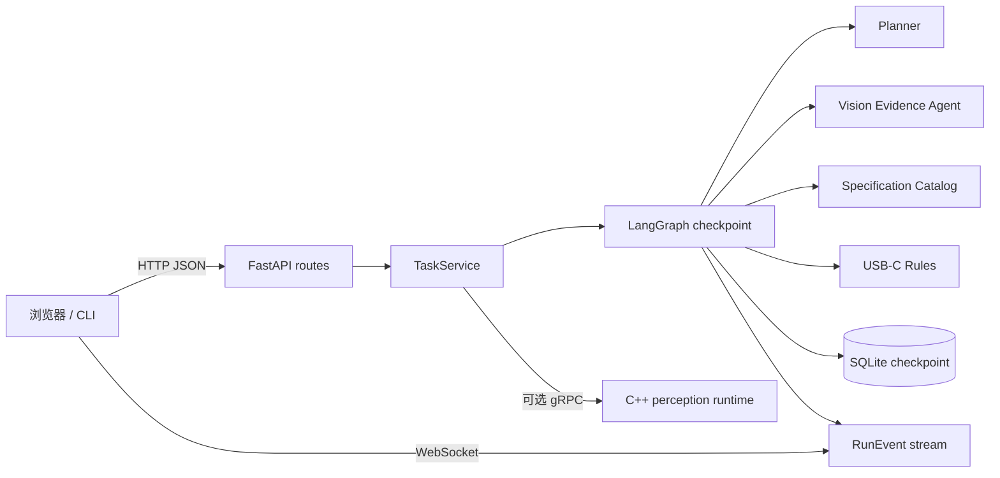

# 第 14 章：FastAPI、实时进度与项目验收

## 1. 本章目标与最终交付

第 13 章已经有了一张可以暂停和恢复的主工作流图，但一个 Python 函数还不是可以演示
的应用。浏览器、CLI 或其他服务需要能创建任务、知道现在在等什么、提交用户答案或
C++ Observation、取消已经不需要的任务，并持续看到过程。第 14 章把这些需求收束到
`TaskService` 和 FastAPI，而不是让 HTTP 路由直接拼装 LangGraph 状态。

本章完成后，RealSight 教学 MVP 有：

- `POST /api/v1/tasks` 创建任务；
- `GET /api/v1/tasks/{session_id}` 获取当前状态摘要；
- `POST /api/v1/tasks/{session_id}/resume` 提交 Observation 或笔记本型号；
- `POST /api/v1/tasks/{session_id}/cancel` 取消任务；
- `WS /api/v1/tasks/{session_id}/events?after_sequence=N` 补发并推送事件；
- SQLite checkpoint 启动入口、Dockerfile、Compose 和离线 API Demo；
- API 自动化测试与最终验收文档。

本章不是在做一个花哨网页。它优先解决应用边界：HTTP 只收发 JSON，浏览器不直连 C++
gRPC，也不接收逐帧视频；图片 artifact 留在本地存储，C++ 仍只向 Python 交付少量
`Observation` 和关键帧路径。

## 2. 三层调用路径



### 2.1 API 层只做协议转换

`api.py` 中的 `CreateTaskRequest` 和 `ResumeTaskRequest` 是 HTTP DTO。它们会拒绝未知字段，
并在边界上检查两个 target ID 不同、`kind=observation` 时确实含 Observation、
`kind=laptop_model` 时确实含型号和来源。随后 `workflow_payload()` 显式转换为第 13 章
`ResumePayload`，并非把原始 JSON 整体传入图。

API 返回的是状态摘要：状态、目标 ID、缺失字段、pending Action、当前 interrupt、检索
状态、规则结果、最终回答和事件数量。它不返回 Python client、SQLite connection、图像
二进制、环境变量或模型密钥。

### 2.2 TaskService 是唯一业务用例入口

`TaskService` 做四件事：

1. 创建 `MainAgentState` 并运行到第一个暂停或终态；
2. 验证并恢复当前 interrupt；
3. 可选地用 `ObservationProvider` 自动完成等待中的观察；
4. 取消时先尽力调用 provider 的取消端口，再把任务置为 `cancelled`。

它不计算 USB-C，不调用 OCR 的内部正则，也不编造 API 结果。这样命令行、FastAPI、未来
桌面端都可以复用同一个业务入口。

`with_memory()` 用于测试和离线 Demo。`with_sqlite()` 创建 `SqliteSaver` 并保持连接到
服务生命周期结束，适合单进程本机 API。SQLite 使进程重启后 checkpoint 仍存在，但不等
于它已经成为分布式任务队列。

### 2.3 同步图与异步 Web 的衔接

第 10、13 章的 gRPC 和 LangGraph 教学代码是同步调用。FastAPI 路由用
`asyncio.to_thread()` 将 `TaskService` 放到工作线程，避免同步图阻塞 ASGI 事件循环。
这不是把所有问题自动变成异步：长时间 OCR、模型调用和 C++ deadline 仍应受第 7 章的
预算、超时、取消和审计治理约束。

## 3. WebSocket 事件为什么按 sequence 重放

每个 `RunEvent` 都有会话 ID、严格递增 `sequence`、类型、消息、时间、关联 ID 和结构化
数据。浏览器断线后只记住最后看见的序号：

```text
第一次连接: after_sequence=0
收到: 1, 2, 3
断线后重连: after_sequence=3
收到: 4, 5, ...
```

第 14 章 MVP 从 checkpoint 轮询这些事件并推送，因此不需要另一个内存事件副本，也能在
同一进程内补发。代价是它不是高吞吐推送总线：多进程、多容器实例或高频实时事件需要
PostgreSQL/Redis、消息代理、消费者游标和背压策略。本项目明确不把这一点包装成“已经
生产可用”。

## 4. API 使用示例

先启动本机服务：

```powershell
uv sync --locked --all-groups
uv run --locked realsight-api
```

访问 `http://127.0.0.1:8000/docs` 可查看自动生成的 OpenAPI 页面。创建任务：

```powershell
Invoke-RestMethod -Method Post http://127.0.0.1:8000/api/v1/tasks `
  -ContentType 'application/json' `
  -Body '{"session_id":"session-local-001","charger_target_id":"charger-local-001","laptop_target_id":"laptop-local-001"}'
```

如果返回 `waiting_observation`，服务正在等第 10 章 C++ 运行时或回放器提交一条合格的
`Observation`。如果返回 `waiting_user`，取出 `interrupt_id`，提交型号：

```powershell
Invoke-RestMethod -Method Post http://127.0.0.1:8000/api/v1/tasks/session-local-001/resume `
  -ContentType 'application/json' `
  -Body '{"interrupt_id":"从状态读取","kind":"laptop_model","laptop_model":"ExampleBook 13","source_id":"user-local-001"}'
```

ExampleBook 是虚构夹具；真实演示要使用经过人工核验的资料目录记录。

## 5. 双模式与密钥处理

示例 `config/realsight.example.toml` 默认：

```toml
[agent]
provider = "deterministic"
openai_model = "gpt-5.6-terra"
reasoning_effort = "medium"
```

离线模式可用于全部单元测试、回放 Demo 和学习。真实模式通过环境变量覆盖：

```powershell
$env:REALSIGHT_AGENT_PROVIDER = "openai"
$env:OPENAI_API_KEY = "你的密钥"
uv run --locked realsight-api
```

服务启动时 `OpenAIPlanner` 才读取 Key；没有 Key 而选择 `openai` 会立刻报出配置错误，
不会静默降级，也不会把密钥记录到状态。真实模型只选择函数工具，最终兼容性仍由纯
`UsbCCompatibilityRules` 给出。真实 API 集成测试应仅在受控环境显式设置 Key 后运行，
不进入默认测试集。

## 6. Docker 边界

`Dockerfile.api` 和 `docker-compose.yml` 只容器化 Python API 与挂载的
`runtime-data`：

```powershell
docker compose up --build
```

Compose 端口绑定 `127.0.0.1:8000:8000`，避免无鉴权教学 API 对局域网暴露。C++ 摄像头
运行时保留在 Windows 宿主机，因为它依赖摄像头、OpenCV、驱动和本机 gRPC 地址。容器化
不是“把所有东西塞进 Docker”；先把硬件边界和服务边界做清楚，日后再决定是否需要设备
直通或边缘部署。

## 7. 运行 Demo 与验收

```powershell
uv run --locked python examples/ch14_api_replay.py
uv run --locked pytest python/tests/test_ch14_api.py -q
```

成功输出包括：

```text
first_event_type = model_decision
status = completed
verdict = conditions_met
CH14_DEMO_OK http=created,resumed websocket=event-replay
```

第一个 API 测试验证创建、自动回放标签观察、WebSocket sequence=1 事件补发、用户型号
恢复和规则结论。第二个测试验证等待中的任务被取消后，旧 interrupt 的恢复请求返回
`409`。这些测试不访问 OpenAI、不启动 Uvicorn，也不伪装成真实硬件验收。

## 8. 本章质量边界

| 已完成 | 尚未作为 MVP 承诺 |
|---|---|
| HTTP/JSON、WebSocket、暂停恢复、取消、SQLite checkpoint 启动 | 登录、权限、租户隔离、TLS |
| 离线可验证回放和可选 OpenAI 规划接口 | 多进程共享事件总线与任务队列 |
| C++ gRPC Observation Provider 端口 | 摄像头驱动、真实 OCR/VLM、真实厂商目录 |
| Docker 化 Python 服务 | C++ 摄像头容器化或逐帧视频传输 |

至此，14 个章节的工程闭环已经建立。下一步不应急着扩大商品种类，而应先用真实但受控
的数据、照片和设备逐项替换教学夹具，并按最终审计报告补足安全、资料治理与硬件验收。
