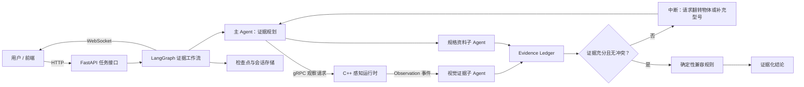

# RealSight 对话记录与项目接续说明

生成日期：2026-08-20  
用途：给另一个 ChatGPT / Codex 账户快速理解本对话、RealSight 项目目标、已经完成的工作、用户要求和后续接续方式。  

> 说明：本文件不复制已经生成的章节正文和代码。章节 Markdown、审计报告、Demo、测试和工程文件都已经在本机 `outputs/realsight/` 仓库中。本文件的目标是保存“对话中的决策、约束、进展和下一步指令”，让另一个账户可以接着做。

---

## 1. 项目来源与用户原始目标

用户最初希望复现一个“C++ 与 Python 构造的 Agent 结合”的项目，项目方向是从 AI 应用开发过渡到 VR / AR / 空间感知。

用户只有约一个月时间学习，因此项目必须兼顾：

- 能做出可运行的工程型 MVP。
- 用户不能只是复制运行代码，而是要真正理解技术栈、项目思想和工程方法。
- 技术栈需要尽量贴近 2026 年企业工程实践。
- 项目要一章一章推进，不能一次性堆完。

原始项目想法：

- C++ 负责实时接触现实世界，接收语音和视频等输入。
- Python 构建 Agent 助手，接收 C++ 感知结果并进行判断。
- 场景聚焦电子物品辅助鉴定。
- C++ 和 Python Agent 都有明确作用，C++ 不是伪装成 Agent，而是实时感知运行时。

用户上传了原始资料：

- `D:/Desktop/留校/章节1.docx`

该文档被作为第一章认知主线来源，重点包括：

- 项目目标。
- 系统架构。
- 核心概念。
- 能力边界。
- 章节产物。
- USB-C 兼容性案例。

---

## 2. 项目重新定位

在后续对话中，项目被重新设计为：

> RealSight：一个可规划、可中断、可恢复、可追踪的主动感知与证据决策系统。

项目不被设计成“很多 Agent 互相聊天”，而是借鉴深度研搜 / DeepAgents 的工程方法：

- 任务规划。
- 上下文管理。
- 子能力分工。
- 长期记忆 / 持久状态。
- 中断恢复。
- 流式事件。
- 人机协作。
- 可审计证据链。

关键边界：

- 一个月内完成工程型教学 MVP。
- 限定单摄像头。
- 限定单目标。
- 限定 USB-C 充电兼容性。
- 支持预录视频与实时摄像头。
- 笔记本型号由用户人工提供。
- 不做通用商品识别。
- 不做真伪鉴定。
- 不逐帧跨进程传输视频。
- C++ 本地完成采集、质量判断、关键帧筛选。
- Python 只接收 Observation 元数据、关键帧路径或按需图像。

---

## 3. 核心架构决策

RealSight 的架构被确定为：

- C++ 感知服务：持续处理摄像头 / 视频回放，不称为 Agent。
- Python 主 Agent：规划证据、调度任务、判断是否需要继续观察。
- 视觉证据子 Agent：从 Observation / 图像 / OCR 文本中抽取 Evidence。
- 设备资料子 Agent：检索设备规格、说明书、USB-C PD 信息。
- 确定性规则引擎：计算 USB-C 功率与兼容性。
- Evidence Ledger：保存证据、来源、置信度、冲突和未知边界。
- LangGraph：负责状态图、可中断、可恢复、检查点和主工作流编排。
- FastAPI / WebSocket：面向前端提交任务和接收实时进度。
- SQLite：保存检查点、证据、事件日志和会话状态。

架构逻辑：



通信决策：

- 浏览器到后端：HTTP / JSON 提交任务。
- 后端到浏览器：WebSocket 推送进度。
- Python 到 C++ 感知运行时：gRPC / Protobuf。
- gRPC 的价值不只是比 HTTP / JSON 延迟更低，还包括：
  - 强类型契约。
  - server streaming。
  - deadline。
  - cancellation。
  - 状态码。
  - 背压。
  - 更稳定的跨语言边界。

用户曾问：“HTTP/JSON 的通信是不是延迟比 gRPC 的延迟更大点？”

回答核心：

- 一般情况下，HTTP/JSON 的序列化体积和解析成本会比 gRPC/Protobuf 更高。
- 但本项目选择 gRPC 的主要原因不是追求极限低延迟，而是 C++/Python 边界需要强类型、流式事件、取消、超时和背压。
- 浏览器侧仍然适合 HTTP/JSON 和 WebSocket，不需要让浏览器直接连 C++ gRPC。

---

## 4. 全课程统一领域类型

用户要求全课程统一使用这些类型，后续只增加字段，不随意改名：

- `TaskSession`：一次可暂停和恢复的任务。
- `RealityObject`：持续存在的现实目标。
- `ObservationRequest`：Agent 发给 C++ 的观察要求。
- `Observation`：C++ 返回的有效观察。
- `Evidence`：带来源、置信度和状态的结构化证据。
- `BeliefState`：已确认、可能、未知和冲突信息。
- `Action`：请求视角、询问用户、调用工具或生成回答。
- `RunEvent`：供日志和 WebSocket 使用的过程事件。

演进方式：

- 第 1 章：用 Python 数据类解释模型。
- 第 4 章：正式固化为 Pydantic 与 Protobuf。
- 第 6 章：加入持久化。
- 第 10 章：接入 C++ gRPC。
- 第 13 章：由 LangGraph 主工作流统一编排。

---

## 5. 用户对章节交付的长期要求

每章必须一章一章生成，不要一次输出所有章节。

每次输出时，都要先鉴定当前生成章节：

- 逻辑是否有问题。
- 技术栈是否介绍清楚。
- 是否有小 Demo 示例。
- 是否与前面章节和后续章节有桥接。
- 第一章只需考虑与后续章节桥接。
- 最后一章只需考虑与前面章节桥接。

用户代码功底不强，因此生成 `.py` 文件必须：

- 在文件顶部有一个较大的中文注释。
- 顶部注释说明：
  - 这个文件整体逻辑是什么。
  - 用到了什么技术栈。
  - 调用流程是什么。
  - 文件边界是什么。
- 代码内部也要有适量中文注释，让初学者能看懂。

从第 9 章开始，用户把这个要求扩展到：

- C++ 文件。
- `CMakeLists.txt` 等 CMake 文件。

所以后续新增或修改的 Python / C++ / CMake 教学文件，也要遵守这个注释风格。

---

## 6. 十四章总体计划

已经确定的 14 章结构：

| 章节 | 学习与实现重点 | 章节产物 |
|---|---|---|
| 1 | 项目导读与边界 | 架构图、USB-C 验收标准、纯 Python 证据缺口 Demo |
| 2 | 最小 Agent 与事件流 | 使用模拟观察工具跑通 CLI |
| 3 | 异步任务与分工边界 | 模拟异步感知服务、取消、超时 |
| 4 | 状态图与协议契约 | Pydantic 状态模型和 `.proto` 协议 |
| 5 | 主动观察与中断恢复 | 可暂停并继续的观察流程 |
| 6 | 检查点与证据存储 | SQLite 检查点、会话目录 |
| 7 | 中间件与系统治理 | 可审计事件日志、调用次数、重试、超时、权限 |
| 8 | 工程初始化 | C++/Python 单仓库骨架、CMake、uv、CI、测试数据 |
| 9 | C++ 实时运行时 | 摄像头 / 视频回放、线程队列、时间戳、帧生命周期 |
| 10 | 观察质量与 gRPC | C++ 向 Python 推送 Observation，关键帧和质量评分 |
| 11 | 视觉证据子 Agent | OCR / 多模态抽取、置信度、来源追踪，USB-C 标签转 Evidence |
| 12 | 资料检索与规则引擎 | 设备规格库、说明书检索、PD 功率计算、冲突检查 |
| 13 | 主 Agent 与完整循环 | 规划、分发、回收、补充观察、验证、生成结论 |
| 14 | API、实时进度与验收 | FastAPI、WebSocket、取消任务、回放测试、Docker |

四周安排：

- 第一周：第 1 到第 4 章，用模拟数据理解 Agent、状态和协议。
- 第二周：第 5 到第 8 章，完成恢复、存储、治理和工程骨架。
- 第三周：第 9 到第 12 章，完成 C++ 感知、gRPC、OCR、资料和规则。
- 第四周：第 13 到第 14 章，联调、回放测试、接口、演示和项目讲解。

---

## 7. 已完成章节与文件位置

项目根目录：

```text
C:\Users\Administrator\Documents\Codex\2026-08-01\referenced-chatgpt-conversation-this-is-an\outputs\realsight
```

章节文档：

```text
outputs/realsight/docs/chapters/01-realsight-active-perception.md
outputs/realsight/docs/chapters/02-minimal-agent-and-event-stream.md
outputs/realsight/docs/chapters/03-async-runtime-and-boundaries.md
outputs/realsight/docs/chapters/04-state-graph-and-contracts.md
outputs/realsight/docs/chapters/05-active-observation-and-interrupt-resume.md
outputs/realsight/docs/chapters/06-checkpoints-evidence-and-artifact-storage.md
outputs/realsight/docs/chapters/07-middleware-and-system-governance.md
outputs/realsight/docs/chapters/08-engineering-initialization.md
outputs/realsight/docs/chapters/09-cpp-realtime-perception-runtime.md
outputs/realsight/docs/chapters/10-observation-quality-and-grpc.md
```

独立质量鉴定报告：

```text
outputs/realsight/docs/reviews/01-quality-audit.md
outputs/realsight/docs/reviews/02-quality-audit.md
outputs/realsight/docs/reviews/03-quality-audit.md
outputs/realsight/docs/reviews/04-quality-audit.md
outputs/realsight/docs/reviews/05-quality-audit.md
outputs/realsight/docs/reviews/06-quality-audit.md
outputs/realsight/docs/reviews/07-quality-audit.md
outputs/realsight/docs/reviews/08-quality-audit.md
outputs/realsight/docs/reviews/09-quality-audit.md
outputs/realsight/docs/reviews/10-quality-audit.md
```

当前已经完成到第 10 章。不要直接跳到第 12 章。下一步应该只生成第 11 章。

---

## 8. 第一章到第十章的对话推进记录

### 第 1 章

标题：

> RealSight：从单图问答到可恢复的主动感知系统

用户要求第一章保留《章节1.docx》的认知主线，同时加入 DeepAgents / LangGraph 架构定位、技术栈地图和可运行小 Demo。

第一章 Demo 要求：

- 纯 Python。
- 不依赖大模型。
- 不依赖第三方包。
- 输入 USB-C 初始证据和必要字段清单。
- 检查缺失的背面标签、功率、协议和笔记本型号。
- 生成 `request_view` 与 `ask_user` 动作。
- 补齐证据后调用确定性兼容规则。
- 输出结论、证据来源和未知边界。
- 使用标准库 `unittest` 覆盖：
  - 证据缺失。
  - 功率不足。
  - 协议未知。
  - 兼容成功。

用户后来上传了对第一章正文的评价，指出第一章审计中“全部通过”的结论偏乐观。之后我们进行了批判性反思，接受真正的问题并修正第一章。

### 第 2 章

主题：

> 最小 Agent 与事件流

重点：

- Tool Calling 思想。
- 结构化输出。
- 流式事件解析。
- 用模拟观察工具跑通 CLI。
- 不接入真实模型。
- 为后续 LangGraph 和 WebSocket 事件流铺垫。

### 第 3 章

主题：

> 异步任务与分工边界

重点：

- `asyncio`。
- 取消。
- 超时。
- 服务与子 Agent 的区别。
- 模拟异步感知服务。
- 明确 C++ runtime 以后承担真实摄像头职责，Python 当前只模拟。

### 第 4 章

主题：

> 状态图与协议契约

重点：

- LangGraph State 的思想。
- Pydantic 模型。
- Protobuf 协议。
- 第 1 章数据类向正式契约演进。
- 用户特别要求 Python 文件顶部必须写清整体逻辑、技术栈和调用流程。

### 第 5 章

主题：

> 主动观察与中断恢复

重点：

- 请求标签。
- 接口特写。
- 设备型号补充。
- `thread_id` 与恢复。
- 可暂停并继续的观察流程。
- 人机协作不再是聊天补充，而是工作流中的显式 Action。

### 第 6 章

主题：

> 检查点与证据存储

重点：

- 区分执行状态、证据、图片产物和长期知识。
- SQLite 检查点。
- 会话目录。
- Evidence Ledger。
- 说明哪些东西该持久化，哪些东西不该塞进 checkpoint。

### 第 7 章

主题：

> 中间件与系统治理

重点：

- 调用次数限制。
- 观察重试。
- 超时。
- 权限。
- 日志。
- 成本限制。
- 可审计事件日志。
- 使教学项目具备企业工程中的治理意识。

### 第 8 章

主题：

> 工程初始化

重点：

- 从前 1 到 7 章的教学脚本整理为正式单仓工程。
- CMake。
- `uv`。
- 配置。
- 目录结构。
- CI。
- 测试数据。
- C++ / Python 单仓库骨架。
- Windows 为首要开发环境，代码保持跨平台。

### 第 9 章

主题：

> C++ 实时感知运行时

重点：

- 摄像头。
- 视频回放。
- 线程队列。
- 时间戳。
- 帧生命周期。
- C++20。
- OpenCV。
- MSYS2 GCC。
- CMake。

用户把注释要求扩展到 C++ 和 CMake 文件：

- 文件顶部要有中文大注释。
- 说明文件逻辑、技术栈、调用流程。

### 第 10 章

主题：

> 观察质量与 gRPC：从连续帧到可追踪 Observation

重点：

- OpenCV 质量评分。
- 模糊、曝光、反光。
- 关键帧选择。
- 不逐帧跨进程传输视频。
- C++ server streaming gRPC。
- Python gRPC client。
- Protobuf 统一生成 C++ / Python 类型。
- deadline。
- cancel。
- error status。
- artifact path。

第 10 章保持边界：

- 不做 OCR。
- 不做视觉证据抽取。
- 不做 USB-C 业务判断。
- 只产出第 11 章可消费的 Observation。

第 10 章特别修正和确认：

- `target_ratio` 只有在有可信 ROI 时才计算；当前 Demo 没有 tracker，因此为 `null`。
- `QualitySignals.glare` 被统一解释为“抗反光质量”，0 表示强反光，1 表示低反光 / 质量好。
- C++ gRPC service 当前使用同步 server streaming，适合单会话教学 MVP；生产高并发应升级 callback API / 设备租约管理。
- 生成 Python proto 时加入 `.pyi`，支持 mypy。
- Windows 路径 JSON 转义问题已修复。
- 第 8 / 9 章旧测试中“不允许出现 gRPC”的边界已改为“不允许 runtime target 链接 gRPC，但允许 transport target 使用 gRPC”。

---

## 9. 当前工程状态

当前仓库中存在这些主要目录：

```text
outputs/realsight/.github
outputs/realsight/config
outputs/realsight/contracts
outputs/realsight/cpp
outputs/realsight/docs
outputs/realsight/examples
outputs/realsight/python
outputs/realsight/scripts
outputs/realsight/tests
```

当前关键实现：

- `contracts/realsight.proto`
- `python/src/realsight/contracts/models.py`
- `python/src/realsight/perception/grpc_client.py`
- `python/src/realsight/generated/realsight_pb2.py`
- `python/src/realsight/generated/realsight_pb2.pyi`
- `python/src/realsight/generated/realsight_pb2_grpc.py`
- `cpp/include/realsight/runtime/frame.hpp`
- `cpp/src/frame.cpp`
- `cpp/include/realsight/perception/quality_evaluator.hpp`
- `cpp/src/quality_evaluator.cpp`
- `cpp/include/realsight/perception/keyframe_selector.hpp`
- `cpp/src/keyframe_selector.cpp`
- `cpp/include/realsight/transport/perception_service.hpp`
- `cpp/src/perception_service.cpp`
- `cpp/apps/grpc_server_main.cpp`
- `cpp/CMakeLists.txt`
- `CMakeLists.txt`
- `scripts/generate_python_proto.py`
- `scripts/run_ch10_demo.py`
- `examples/ch10_observation_stream.py`
- `python/tests/test_ch10_grpc_adapter.py`
- `cpp/tests/quality_evaluator_test.cpp`
- `cpp/tests/keyframe_selector_test.cpp`

当前第 10 章验证结果：

- Python 格式检查通过。
- Python ruff 检查通过。
- mypy 通过。
- pytest 通过：`147 passed`。
- C++ Debug 配置、构建和 CTest 通过：`6/6 tests passed`。
- C++ Release 配置、构建和 CTest 通过：`6/6 tests passed`。
- `uv run --locked realsight-doctor` 显示 READY=true。
- `uv run --locked python scripts/run_ch10_demo.py` 通过，输出 `CH10_DEMO_OK transport=cpp_to_python artifact=verified`。
- `uv run --locked python scripts/run_ch10_demo.py --verify-cancel` 通过，输出 `CH10_CANCEL_OK cancel_rpc=accepted status=CANCELLED`。

本地工具链状态：

- Python 3.12.13。
- uv 0.11.30。
- CMake 4.4.2。
- g++ 16.2.0。
- OpenCV 5.0.0。
- protoc / libprotoc 35.1。
- grpc_cpp_plugin 位于 MSYS2 UCRT64。
- Python grpcio 1.83.0。

第 10 章安装过的 MSYS2 依赖：

```powershell
E:\msys64\usr\bin\pacman.exe -S --needed --noconfirm mingw-w64-ucrt-x86_64-grpc
```

已经存在 OpenCV：

```text
mingw-w64-ucrt-x86_64-opencv
```

注意：当前摘要里提到曾经尝试 `git status`，但这个工作区不是 Git 仓库，不能假设有 git diff。

---

## 10. 用户当前希望保存对话给另一个账号

用户问过：

> 假如我想要将我们这个对话保存，使得其他账户的 gpt 也能够使用这个对话的记录，应该如何做？

回答要点：

- 可以用 ChatGPT 共享链接。
- 共享链接通常是创建链接时的快照。
- 其他账户打开后可以查看，并在自己的账户中开始副本。
- 不适合包含 API Key、隐私和未公开项目资料。
- 也可以用 ChatGPT 数据导出作为长期备份。
- 对 RealSight 项目而言，最重要的是同时保存本地 `outputs/realsight/` 仓库，因为另一个 GPT 继续工作不仅需要聊天记录，还需要章节、代码、测试和 Demo。

用户又要求：

> 将我当前的对话生成共享链接

回答要点：

- 当前助手不能直接替用户生成共享链接。
- 需要用户在 ChatGPT / Codex 界面点 Share / 分享。

用户当前最后要求：

> 将我们的当前对话所有内容全部生成为一个 markdown 文件，不必生成我章节的代码这些内容，我只需要对话记录，这些生成的项目文件都在我电脑中，我生成这个 markdown 文件的目的是为了让另一个 chatgpt 账户快速的了解我的项目，并继续你的工作

本文件就是为这个目的生成。

---

## 11. 给另一个 ChatGPT / Codex 的接续提示

如果另一个 GPT 要继续这个项目，建议直接给它下面这段指令：

```text
你正在接手 RealSight 项目。请先阅读这个交接文件：

outputs/realsight/docs/handovers/current-conversation-handoff.md

再阅读已经完成的章节和审计报告：

outputs/realsight/docs/chapters/01-realsight-active-perception.md
...
outputs/realsight/docs/chapters/10-observation-quality-and-grpc.md

outputs/realsight/docs/reviews/01-quality-audit.md
...
outputs/realsight/docs/reviews/10-quality-audit.md

不要重新生成第 1 到第 10 章。不要跳到第 12 章。

下一步只生成第 11 章：

第 11 章主题：视觉证据子 Agent
学习重点：OCR、多模态抽取、置信度、来源追踪。
章节产物：从第 10 章的 Observation / image_path 中生成 USB-C 标签 Evidence。

生成第 11 章时，必须先输出独立质量鉴定：
1. 逻辑是否闭环。
2. 技术栈是否说明是什么、为什么用、在哪章实现。
3. Demo 是否足够小、可运行、输出可验证。
4. 是否清楚桥接第 10 章和第 12 章。

用户代码功底不强，所有新增 Python / C++ / CMake 教学文件顶部必须有中文大注释，说明：
1. 文件整体逻辑。
2. 使用的技术栈。
3. 调用流程。
4. 当前边界。

第 11 章不要直接做 USB-C 兼容性规则，那是第 12 章。
第 11 章不要把 C++ 运行时变成 Agent。
第 11 章应该消费第 10 章的 accepted Observation，尤其是 image_path、quality、view_type、reality_object_id、source_frame_sequence/source_position_ms。
```

---

## 12. 第 11 章建议设计方向

第 11 章应该做：

- 视觉证据子 Agent 的职责边界。
- Observation 到 Evidence 的转换。
- OCR 结果的结构化。
- 多模态模型在真实企业系统中的位置。
- MVP 中先使用可控的 OCR 文本 / 模拟视觉提取，避免把章节卡在大型模型或外部服务上。
- 保留后续接入真实 OCR / 多模态模型的接口。
- 证据必须带来源：
  - 来源 Observation ID。
  - 来源图片路径。
  - 来源帧序号。
  - 来源视频位置。
  - 抽取方法。
  - 置信度。
  - 证据状态。
- 不在第 11 章计算“能不能给电脑充电”，只抽取：
  - 充电器最大输出功率。
  - USB-C / PD 协议迹象。
  - 标签文本。
  - 型号文本。
  - 是否需要更清晰图片或背面标签。

第 11 章 Demo 建议：

- 输入一个第 10 章风格的 `Observation`。
- 输入一段模拟 OCR 文本，例如：

```text
USB-C PD Charger
Output: 5V=3A, 9V=3A, 15V=3A, 20V=3.25A
Max 65W
Model: RC-65C
```

- 解析为 Evidence：
  - `charger.max_power_w = 65`
  - `charger.protocol.usb_pd = true`
  - `charger.output_profiles = ["5V=3A", "9V=3A", "15V=3A", "20V=3.25A"]`
  - `charger.model = "RC-65C"`
- 输出 Evidence Ledger。
- 覆盖测试：
  - 成功解析 65W PD。
  - 缺少 PD 协议时生成 unknown / needs_more_evidence。
  - 文本冲突时生成 conflict。
  - Observation 质量差时拒绝高置信度证据。

第 11 章桥接：

- 向前桥接第 10 章：C++ 只负责 Observation 和 keyframe，不负责 OCR。
- 向后桥接第 12 章：第 12 章消费 Evidence，结合设备资料和规则引擎判断 USB-C 兼容性。

---

## 13. 当前可用验证命令

在项目根目录：

```powershell
cd C:\Users\Administrator\Documents\Codex\2026-08-01\referenced-chatgpt-conversation-this-is-an\outputs\realsight
```

常用验证：

```powershell
uv sync --locked --all-groups
uv run --locked realsight-doctor
uv run --locked pytest -q
uv run --locked mypy
uv run --locked ruff check python/src python/tests examples scripts
uv run --locked ruff format --check python/src python/tests examples scripts
```

C++ Debug：

```powershell
uv run --locked cmake --preset windows-gcc-debug
uv run --locked cmake --build --preset windows-gcc-debug
uv run --locked ctest --preset windows-gcc-debug
```

第 10 章端到端 Demo：

```powershell
uv run --locked python scripts/run_ch10_demo.py
uv run --locked python scripts/run_ch10_demo.py --verify-cancel
```

---

## 14. 接续时必须注意的边界

- 不要把 RealSight 改造成一堆 Agent 互相聊天。
- C++ runtime 是服务，不是 Agent。
- 第 11 章只做 Observation 到 Evidence。
- 第 12 章才做资料检索和 USB-C 兼容规则。
- 第 13 章才做主 Agent 完整编排。
- 第 14 章才做 FastAPI / WebSocket / Docker 闭环。
- 不要逐帧跨进程传输视频。
- 不要把质量分直接当成 Evidence confidence，需要解释映射关系。
- 不要把 OCR 文本当成事实，必须带来源、置信度和状态。
- 不要把模型判断作为最终兼容性结论，最终兼容性必须由确定性规则引擎计算。
- 后续如果查询 2026 年最新框架、API 或模型，需要联网查官方文档，不要凭旧记忆。

---

## 15. 一句话项目定位

RealSight 不是一个“看图回答问题”的玩具项目，而是一个用 C++ 负责实时感知、Python / LangGraph 负责可恢复证据工作流、以 USB-C 充电兼容性为教学案例的主动感知与证据决策系统。

